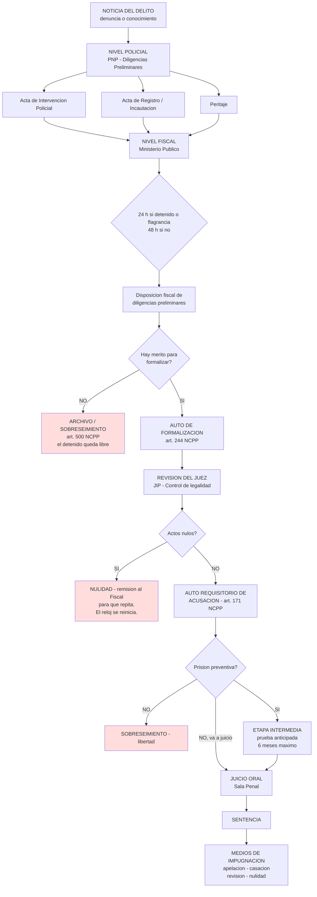
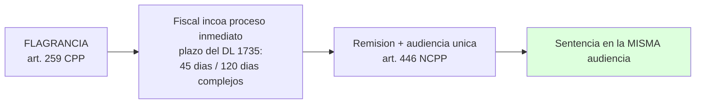

# CASO REAL EN PERÚ: GESTIÓN DEL EXPEDIENTE Y CONFIABILIDAD DE LA INFORMACIÓN

**Proyecto:** FOXIT — Document Traceability Layer
**Estado:** Documento de trabajo 01 (base factual). NO contiene diseño Foxit.
**Alcance:** Describir cómo se gestiona un caso penal real en el Perú: con qué plazos, qué documentos se emiten, quién responde por cada uno, dónde se rompe la cadena y por qué la responsabilidad se diluye.

---

## 0. ADVERTENCIA DE MÉTODO

Este documento separa explícitamente tres cosas, porque mezclarlas es la causa del problema que queremos atacar:

| Marca | Significado |
|---|---|
| **VERIFICADO** | Texto normativo localizado en fuente publicada (Congreso, MPFN, jurisprudencia). |
| **VERIFICAR** | El requisito existe pero **no se confirmó el número exacto de artículo o la redacción vigente**. Un abogado peruano debe cerrarlo antes de usar esto frente a una institución. |
| **SUPUESTO DE DISEÑO** | Control que propondremos nosotros, que **no es** obligación legal vigente. |

> **Regla dura:** no se inventan plazos ni artículos. Lo que no se verificó va marcado.
>
> **Cobertura verificada:** D.Leg. N.° 1735 (2026), Ley N.° 32130, Reglamento de la Fiscalía General del Perú, Protocolo Interinstitucional de Proceso Inmediato (MPFN, 2015), jurisprudencia sobre prueba pericial.
>
> **Cobertura NO verificada:** texto consolidado y última modificatoria del NCPP, Reglamento de la Fiscalía, Ley N.° 19438 y su Reglamento. **Debe cerrarse antes de cualquier presentación institucional.**

---

## 1. MARCO NORMATIVO APLICABLE

| Norma | Qué regula | Estado |
|---|---|---|
| **NCPP** — D.Leg. N.° 957, refundido y reordenado por **D.Leg. N.° 1244** | Procedimiento penal adversarial: etapas, plazos, prueba, medidas coercitivas. | VERIFICADO |
| **D.Leg. N.° 1735** (2026) | Modifica arts. 209, 222, 259, 266, 360, 446, 447, 472, 474 y 475 del CPP. Plazo de retención a 8 h, **amplía la flagrancia a 72 h** en homicidio, sicariato, extorsión, secuestro y criminalidad sistemática, y agiliza el **proceso inmediato**: el fiscal debe solicitarlo en **45 días, o 120 en casos complejos**. | VERIFICADO |
| **Ley N.° 32130** | Modifica el CPP. Refuerza a la PNP como ejecutora de los mandatos del Ministerio Público. | VERIFICADO |
| **Ley N.° 30037** | Modifica el CPP para fortalecer la investigación del delito como función de la PNP y agilizar los procesos penales. | VERIFICAR |
| **Ley N.° 19438** | Reglamento de la Policía Nacional del Perú: acta de intervención policial, sistemas de registro. | VERIFICAR |
| **Reglamento de la Fiscalía General del Perú** | Contiene la regla más concreta sobre control de plazos: *"En los casos de detención cuyo plazo máximo sea de 48 horas, el plazo otorgado a la unidad policial debe ser el razonable antes de su vencimiento, a fin de que el fiscal pueda evaluar los actuados, realizar los actos de investigación adicionales que se requieran y, de ser el caso, formular los requerimientos correspondientes ante la autoridad judicial. En los demás casos cuyo plazo de detención sea mayor a las 48 horas, el plazo de investigación otorgado a la unidad policial debe ser el estrictamente necesario."* | VERIFICADO |
| **Código de Procedimientos Penales de 1940 (Ley 9024)** | Sigue rigiendo en distritos judiciales donde el NCPP no entró en vigor. **En esos distritos el flujo NO es el descrito aquí.** | VERIFICADO |

> **Advertencia crítica:** la coexistencia del NCPP (2004) y del CPP de 1940 implica que **no existe un flujo único a nivel nacional**. Cualquier estandarización de documentos debe declarar para qué distrito judicial aplica.

### 1.1 Principios que gobiernan todo el flujo

| Principio | Artículo | Implicación operativa |
|---|---|---|
| Presunción de inocencia | **NCPP art. 2 inc. 1** y **art. 6** | Ningún documento preliminar presume culpabilidad. Un acta redactada como si el delito estuviera probado es nula de pleno derecho. |
| Objetividad, razonabilidad, celeridad | **NCPP art. 2 inc. 2** | Obliga a incorporar también lo que **exculpa**. El informe unilateral es un vicio grave. |
| Legalidad | **NCPP art. 2 inc. 3** | No cabe crear ningún documento cuya creación no esté prevista en la norma. |
| Hábeas corpus | **NCPP art. 7** | Es el mecanismo para acabar con la **detención arbitraria por vencimiento de plazos**. |

---

## 2. EL PROCESO COMPLETO EN UN DIAGRAMA

### 2.1 Ruta alterna: Proceso Inmediato

> **Valor documental de esta ruta:** evita la formación de expediente físico largo, y por lo tanto **reduce puntos de quiebre**.
>
> Regla interinstitucional verificada: *"Si el imputado se encontrare bajo detención policial (detención en flagrancia), el Fiscal debe solicitar al Juez de la Investigación Preparatoria la incoación del proceso inmediato, dentro del plazo de dicha detención."* (Protocolo de Actuación Interinstitucional para el Proceso Inmediato, MPFN, 2015)

---

## 3. LÍNEA DE TIEMPO: CON RELOJ Y CON SECUENCIA

Esta es la parte central del documento. Cada fila es **un reloj que corre**. Si el reloj vence sin el documento correspondiente, la persona sale libre.

| # | Momento | Acto | Documento que se emite | Qué pasa si el plazo se vence |
|---|---|---|---|---|
| 1 | T0 | Flagrancia o denuncia | **Acta de Intervención Policial** | --- |
| 2 | T0 + minutos | Traslado a unidad policial | **Acta de Registro Personal** | --- |
| 3 | T0 + horas | Reconocimiento del lugar | **Acta de inspección / acta del lugar** | --- |
| 4 | T0 + horas | Recojo de evidencia | **Acta de Incautación** + **Acta de entrega y recepción** | Evidencia sin cadena de custodia queda **nula** |
| 5 | T0 + horas | Peritación | **Informe pericial** del perito oficial | Sin peritaje no hay evidencia técnica utilizable |
| 6 | T0 + 24 h | El fiscal recibe la noticia | **Disposición fiscal de preliminares** | Vencimiento del plazo de detencion implica **libertad** |
| 7 | T0 + 24/48 h | Duracion de preliminares | **Nota de otorgamiento de plazo** a la PNP | El Reglamento de la Fiscalía exige plazo "razonable antes de su vencimiento" o "estrictamente necesario". Incumplir es causal de nulidad. |
| 8 | T0 + dias | Cierre de preliminares | **Auto de formalización** (art. 244) | Sin formalizar, el caso se **archiva** (art. 500) y hay **libertad** |
| 9 | Formalización + 5 dias | Remisión al JIP | **Constancia de remisión** (art. 141) | Expediente varado entre mesa y juez: **nadie es dueño** |
| 10 | Remisión + dias | Control de legalidad | **Resolución del JIP** | Nulidad de actos: **el expediente regresa al Fiscal** |
| 11 | Auto requisitorio + plazo | Contestación de acusación | **Escrito de contestación** | Rebeldía: paso al proceso sin contestación |
| 12 | Resto del plazo | Control del JUDGE | **Auto de sobreseimiento** | **Libertad** |
| 13 | Antes de que el plazo venza | **Requisitorio de prision preventiva** | **Auto de prision preventiva** (arts. 253-254) | Sin requerimiento del fiscal: **libertad por falta de peticion** |
| 14 | 6 meses maximo | Etapa intermedia | **Auto que admite prueba anticipada** | Cierre de la instruccion preparatoria |
| 15 | Juicio | Sentencia | **Sentencia con constancia de firma** | --- |
| 16 | Plazo de impugnacion | Impugnacion | **Recurso** | Fallo firme: se pierde la posibilidad de revertir |

### 3.1 Regla de oro: los plazos son en días hábiles

> **VERIFICAR** la numeración consolidada. La estructura del NCPP es:
>
> - **10 dias habiles** para emitir el auto de formalizacion.
> - **+ 5 dias** para la remision al Juez de la Investigacion Preparatoria.
> - Total tipico en la practica forense: **15 a 18 dias** desde T0 hasta el auto requisitorio.
>
> **CRÍTICO:** esos plazos se cuentan en **días hábiles**, no calendario. Un feriado, un fin de semana, un expediente mal derivado, y el conteo se come el margen.
>
> **Este es el punto exacto donde "dejan libre al detenido": no por decisión de nadie, sino porque un plazo venció y el sistema no tiene un reloj que avise.**

---

## 4. LOS DOCUMENTOS Y QUÉ PRUEBA CADA UNO

| Etapa | Documento | Emisor | Qué prueba | Dónde vive hoy | Firma o sello que lo hace válido |
|---|---|---|---|---|---|
| Policial | Acta de Intervención Policial | PNP | Qué pasó, cuándo, quién, en qué condiciones | Carpeta policial | Jefe de unidad + placa |
| Policial | Acta de Registro Personal | PNP | Identificación del detenido | Carpeta policial | Comisionados |
| Policial | Acta de Incautación | PNP | Qué se tomaron de la escena | Carpeta policial | Comisionados |
| Policial | **Acta de entrega y recepción de peritos** | PNP y perito | **Cadena de custodia** de la evidencia | Carpeta policial | **Ambos** |
| Pericial | **Acta de juramento del perito** | Perito | Que el perito actuó con conciencia | Expediente fiscal | Perito |
| Pericial | **Informe pericial (perito oficial)** | Perito | Valor técnico del elemento | Expediente fiscal | **Perito + juramento** |
| Pericial | **Informe u observaciones del perito de parte** | Perito de parte | Contradicción técnica | Expediente fiscal | Perito de parte |
| Fiscal | Disposición de preliminares | Fiscal | Qué instrucciones da a la policía | Expediente fiscal | Fiscal + sello |
| Fiscal | **Auto de formalización** | Fiscal | Pasa a investigación formal | Expediente fiscal | Fiscal + sello |
| Fiscal | Requerimiento de acusación | Fiscal | Va a juicio | Expediente judicial | Fiscal |
| Fiscal | Dictamen de sobreseimiento | Fiscal | Cierra el caso | Expediente fiscal | Fiscal Superior (control) |
| Judicial | **Auto requisitorio** | JIP | La acusación es suficiente | Expediente judicial | Juez + secretaría |
| Judicial | **Auto de prisión preventiva** | JIP | Fundamento para coartar libertad | Expediente judicial | Juez + secretaría |
| Judicial | Sentencia | Sala / JLP | Culpa o inocencia | Expediente judicial | Jueces + secretaría |
| Transversal | **Acta de remisión / constancia** | GS / MP / JIP | Quién entregó a quién | Expediente judicial | Receptor + hora exacta |

### 4.1 Reglas del peritaje: el corazón de la confiabilidad

| Regla | Contenido | Estado |
|---|---|---|
| **Quién nombra** | Perito **oficial o de oficio** (juez o fiscal) o **perito de parte** (imputado, agraviado, actor civil) | VERIFICADO |
| **Cuándo puede nombrar el perito de parte** | Dentro de los **5 días** de notificado el nombramiento del oficial, u otro plazo que acuerde el juez | VERIFICADO |
| **Dependencia temporal** | Las operaciones periciales **esperan** al perito de parte, salvo caso urgente o en extremo simple. Vencidos los 5 días, el perito oficial queda habilitado a iniciar | VERIFICADO |
| **Contenido obligatorio del informe** | a) nombre, domicilio, DNI y registro profesional del perito; b) descripción de la situación o estado de hechos; c) descripción de las operaciones realizadas; d) conclusiones | VERIFICADO |
| **Prohibición absoluta** | *"El informe no puede contener juicios respecto a la responsabilidad o no responsabilidad penal del imputado"* | VERIFICADO |
| **Discrepancia** | El perito de parte presenta su informe; se pone en conocimiento del oficial para que se pronuncie en el término de **5 días** | VERIFICADO |
| **Ampliación** | Si el informe es insuficiente, se ordena la ampliación al mismo perito o se nombra otro | VERIFICADO |
| **Fase 2: examen en audiencia** | Declaración y examen del perito en audiencia (art. 181 CPP). Se le pregunta si el dictamen **sufrió alteración** y si su firma aparece en él | VERIFICADO |
| **Reserva** | *"El perito tiene la obligación de guardar reserva de cuanto conozca con motivo de su intervención"* | VERIFICADO |
| **Informe pericial sin formalización** | Si la investigación preparatoria **no se formalizó** o se archivó, el informe pericial **carece de valor probatorio** | VERIFICAR |

> La penúltima regla es la más importante y la menos conocida: **un peritaje bien hecho, en una investigación que nunca se formalizó, vale cero.** Todo el trabajo se pierde, y nadie se entera hasta la audiencia.

---

## 5. DÓNDE SE ROMPE LA CADENA

Este es el corazón del problema. Nueve puntos de quiebre, ordenados por frecuencia observada.

```mermaid
flowchart TB
    Q1["1. NOTICIA A MESA<br/>Derivacion mal dirigida"] --> L1["El expediente llega a<br/>la mesa equivocada.<br/>El reloj ya corre."]

    Q2["2. DEPOSITO DE LA DENUNCIA<br/>ante el fiscal"] --> L2["No hay constancia de<br/>QUIEN recibio, CUANDO<br/>y con que folios.<br/>Nadie sabe en que despacho esta."]

    Q3["3. PLAZO A LA POLICIA<br/>mal calculado"] --> L3["El fiscal otorga 8 h.<br/>La PNP precisa 12 h.<br/>Vence por 4 h:<br/>nulidad de lo actuado."]

    Q4["4. CADENA DE CUSTODIA<br/>rota"] --> L4["Evidencia sin acta de<br/>entrega y recepcion,<br/>o con hora distinta a la<br/>del acta: peritaje nulo."]

    Q5["5. REMISION<br/>al JIP"] --> L5["Sin constancia de remision.<br/>Expediente en el limbo.<br/>Silencio administrativo."]

    Q6["6. AUTO DE FORMALIZACION<br/>vence"] --> L6["El fiscal no formaliza en plazo.<br/>Se archiva (art. 500)<br/>y hay libertad.<br/>Nadie responde porque<br/>nadie fue alertado."]

    Q7["7. NULIDAD<br/>por vicio formal"] --> L7["El JIP declara nulos los actos<br/>y remite al Fiscal.<br/>El reloj se reinicia<br/>y el plazo se duplica."]

    Q8["8. PRISION PREVENTIVA<br/>no solicitada"] --> L8["La formalizacion llega tarde.<br/>La audiencia pasa sin<br/>requerimiento del fiscal:<br/>libertad."]

    Q9["9. NOTIFICACIONES<br/>y citaciones"] --> L9["Se pierde el expediente.<br/>Se cita a un domicilio<br/>equivocado. No hay<br/>quorum en la audiencia.<br/>Nadie asume el riesgo."]

    style L2 fill:#ffdddd
    style L4 fill:#ffdddd
    style L6 fill:#ffdddd
    style L7 fill:#ffdddd
    style L8 fill:#ffdddd
    style L9 fill:#ffdddd
```

### 5.1 Por qué "nadie se hace responsable": el diagnóstico estructural

No es un problema de personas. Es un problema de **custodia del documento sin dueño declarado**. Cuatro mecanismos lo causan:

| # | Mecanismo | Cómo se manifiesta |
|---|---|---|
| A | **La transferencia es un evento, no un registro** | Dos folios firman y cada uno guarda su copia. La copia se archiva física, se escanea sin cargo, y **nunca se cruza**. Cuando algo falta, se entera el juez, no los operadores. |
| B | **El documento se actualiza en vez de versionarse** | Se corrige el acta, se reimprime, se firma otra vez y se reemplaza el archivo. **El original desaparece sin dejar rastro.** Nadie puede decir qué cambió, cuándo ni por qué. |
| C | **El reloj vive en la cabeza del fiscal** | El plazo está anotado en un cuaderno, en la cabeza, o en un Excel personal. Si el fiscal se enferma, se cambia de despacho, o acumula 300 expedientes nuevos, **el plazo no se entera nadie**. No hay alerta. No hay escalamiento. |
| D | **La evidencia física es el eslabón más frágil** | Un bien pasa por: escena, comisaría, laboratorio de la PNP, almacén, Poder Judicial. **Cinco puntos de fragilidad con cinco actas distintas, en papeles distintos.** Un solo sello mal puesto equivale a prueba perdida, y no hay forma de probarlo en contra. |

> **La paradoja:** el expediente que más papel genera es el que menos memoria conserva. Cada copia es una oportunidad de divergencia.

---

## 6. CÓMO GESTIONAN LA CONFIABILIDAD HOY

| # | Control existente | Dónde vive | Qué protege | Qué **NO** protege |
|---|---|---|---|---|
| 1 | **Foliar y matricular** el expediente | Expediente físico | Orden de fojas | No detecta una foja **extraída** si el número de folio se collinea al final |
| 2 | **Firma del responsable** en cada acta | Actas | Quién hizo qué | No detecta que el firmante no sabía lo que firmaba |
| 3 | **Acta de entrega y recepción** | Cadena de custodia | En manos de quién está el bien | No detecta alteración del bien mientras estuvo en custodia |
| 4 | **Peritaje con juramento** | Expediente | Integridad técnica | No detecta si el perito cambió su conclusión después |
| 5 | **Acuse de remisión o cargo** | Constancia de remisión | Quién recibió | No detecta pérdida posterior ni demora en el traslado |
| 6 | **Sellos de recepción** | Mesa de partes | Fecha de ingreso | **No marca la hora exacta**, y eso invalida plazos |
| 7 | **Perito oficial y perito de parte** | Prueba pericial | Contradicción técnica | Solo funciona si el perito de parte **sí llega** a designar |
| 8 | **Reserva del perito** | Obligación legal | Confidencialidad | No es verificable externamente |
| 9 | **SIP y sistemas institucionales** | Software | Registro de operaciones | **No son un registro de documentos.** Registran hechos, no documentos. |
| 10 | **Archivo general y conservación** | Archivadores | Conservación a largo plazo | Conserva; **no prueba qué pasó antes** |

### 6.1 Lo que NO existe hoy en el flujo estándar

Estas ausencias son las que el MVP tendría que cubrir:

| Ausencia | Consecuencia real observada |
|---|---|
| **No hay hash del documento** | No se puede demostrar que el PDF que llegó al juez es el mismo que firmó la policía. Un PDF es texto plano comprimido: cambiar una fecha es trivial e indetectable. |
| **No hay historial de versiones** | Una corrección legítima es indistinguible de una alteración indebida. |
| **No hay sello de tiempo confiable** | Las actas usan la hora del reloj del operador. Dos equipos desincronizados producen dos horas distintas: el plazo vence o no vence según el equipo. |
| **No hay bitácora de solo agregado** | El registro de operaciones se puede editar. Nadie tiene interés en editarlo, y por eso no se nota. |
| **No hay responsable único por tramo** | La responsabilidad es difusa por diseño, y en la práctica equivale a que **nadie es dueño**. |
| **No hay alerta de vencimiento de plazo** | Es la fila 6 de la línea de tiempo, y la causa número uno de libertad. |
| **No hay integración entre sistemas** | PNP, Ministerio Público y Poder Judicial no comparten registro. Cada uno tiene su versión de la verdad. |
| **No hay forma de reconstruir qué había antes** | Cuando el juez pregunta si el documento estaba así el día de la detención, la respuesta es un escaneo de hace tres años y un testigo que ya no trabaja en la institución. |

---

## 7. LOS PLAZOS QUE PRODUCEN LIBERTAD

Los plazos tienen responsable nominal, y ese es precisamente el problema:

| Plazo | Responsable nominal | Quién lo monitorea hoy | Hay alerta automática |
|---|---|---|---|
| 24 h (con detenido o flagrancia) | Fiscal | El fiscal | **No** |
| 48 h (sin detenido) | Fiscal | El fiscal | **No** |
| Plazo otorgado a la unidad policial | Fiscal hacia la PNP | Nadie conoce el valor exacto hasta que vence | **No** |
| 10 días hábiles (formalización) | Fiscal | El fiscal | **No** |
| 5 días (remisión) | Fiscal | El fiscal | **No** |
| Plazo de audiencia preliminar | JIP y coordinadores | Nadie | **No** |
| Plazo de impugnación | Abogado o parte | El abogado | **No** |

> **Todos los relojes están en la cabeza de una sola persona.** Cuando esa persona cambia de turno, se licencia, viaja, o recibe trescientos expedientes nuevos, **el reloj se detiene porque nadie lo está mirando.** Ese es el fallo de sistema, y es el que libera al detenido.

---

## 8. CHECKLIST DE CONTROL POR ETAPA

Este checklist es el contrato que un caso debería cumplir. Cada ítem es hoy una buena práctica informal, no un control verificable.

### Etapa A: Intervención policial
- [ ] Acta de intervención con hora de inicio y fin **precisas al minuto**
- [ ] Acta de registro personal con huella y firma del detenido
- [ ] Número de expediente asignado antes de la diligencia
- [ ] Reloj del equipo sincronizado, o sello de hora de fuente confiable
- [ ] Detenido informado de sus derechos (silencio, abogado, asistencia) - **art. 12 NCPP, VERIFICAR**
- [ ] Constancia de qué se hizo con los efectos personales retenidos

### Etapa B: Cadena de custodia
- [ ] Acta de entrega y recepción por **cada** traspaso
- [ ] Misma hora en el acta y en el sello físico
- [ ] El perito **juramenta** antes de operar
- [ ] El perito de parte tiene **ventana de 5 días** ejercida o renunciada por escrito
- [ ] El informe pericial **no contiene** juicios de responsabilidad penal
- [ ] Si hubo discrepancia, traslado al oficial con plazo de 5 días

### Etapa C: Fiscal
- [ ] Disposición de preliminares dentro de 24 o 48 horas
- [ ] Plazo a la PNP **escrito, expreso y razonable**
- [ ] Constancia de **qué** y **cuántos folios** se remiten
- [ ] Auto de formalización dentro del plazo de días hábiles
- [ ] Remisión al JIP dentro de los 5 días siguientes
- [ ] Si se va a archivar: revisado por el Fiscal Superior

### Etapa D: Judicial
- [ ] Constancia de remisión devuelta y firmada
- [ ] Resolución de control de legalidad dictada
- [ ] Auto requisitorio notificado a todas las partes
- [ ] **Requisitorio de prisión preventiva** emitido si corresponde
- [ ] Si se dicta sobreseimiento, **consta el fundamento**

### Etapa E: Transversal
- [ ] Cada documento tiene **hash registrado** en el momento de emitirse
- [ ] Cada transferencia tiene constancia con fecha **y hora exacta**
- [ ] Cada modificación crea **versión nueva**; la anterior es inmodificable
- [ ] Ningún archivo es sobrescrito, jamás
- [ ] Existe un **dueño nominal por tramo**, no un "departamento"

---

## 9. MATRIZ DE RESPONSABILIDAD

| Tramo | Responsable nominal | Responde por | Evidencia de que lo hizo |
|---|---|---|---|
| Noticia criminal | Comisionado receptor | Conocer y derivar en el plazo | Acta + constancia de ingreso |
| Preliminares | Jefe de unidad PNP | Ejecutar y **rendir cuentas** del plazo otorgado | Informe policial + cargo |
| Disposición de preliminares | Fiscal | **Fijar un plazo razonable** y no excederse | Disposición escrita |
| Peritaje | Perito oficial | Integridad de la evidencia y del dictamen | Acta de entrega y recepción + juramento + informe |
| Peritaje contradictorio | Perito de parte | Ejercer dentro de 5 días o renunciar | Designación o renuncia escrita |
| Formalización | Fiscal | Emitir dentro del plazo de días hábiles | Auto de formalización |
| Remisión | Fiscal | Remitir dentro de los 5 días | Constancia de remisión |
| Control de legalidad | JIP | Dictar resolución; **no dejar el expediente sin resolver** | Resolución motivada |
| Prisión preventiva | Fiscal (requiere) / JIP (dispone) | Fundamento conforme arts. 253-254 | Auto **motivado** |
| Sobreseimiento | JIP / Sala | Cerrar con fundamento | Auto de sobreseimiento |
| Supervisión | Fiscal Superior | Control del cumplimiento de plazos de sus fiscales | Informe de supervisión |
| Archivo | Órgano de gestión documental | Conservar sin alterar | Registro de archivo |

> **El vacío estructural:** cada fila tiene un responsable nominal. **Ninguna columna dice quién verifica al responsable anterior.** De ahí el "nadie se hace cargo".

---

## 10. BRECHAS DE CONFIABILIDAD Y REQUISITOS

Se documenta **qué debe pasar**, no con qué API. El mapeo a Foxit se hace después, en documento aparte.

| # | Brecha | Requisito funcional que la cierra |
|---|---|---|
| 1 | El PDF no tiene identidad verificable | Todo documento emitido queda con **sello de integridad (hash)** al momento de crearse |
| 2 | No se puede probar que un archivo no cambió | **Verificación de integridad** reproducible por un tercero, sin acceso al sistema |
| 3 | Las correcciones destruyen el original | **Versionado inmutable**: corregir genera versión nueva; la anterior queda preservada y consultable |
| 4 | Las transferencias no dejan rastro fiable | **Constancia de transferencia** con emisor, receptor, fecha **y hora exacta**, y huella del contenido |
| 5 | La hora es la del reloj del operador | **Sello de tiempo** confiable por documento, no por equipo |
| 6 | Los plazos viven en la cabeza de alguien | **Reloj de plazos** con vencimiento calculado y **escalamiento automático** antes de vencer |
| 7 | Nadie sabe qué versión está en el expediente judicial | **Versión vigente declarada** y **comparación** entre lo que firma un actor y lo que tiene el siguiente |
| 8 | Nadie sabe de dónde viene cada documento | **Linaje documental**: origen, transformaciones, destino, verificable de extremo a extremo |
| 9 | Un mismo documento tiene versiones distintas en tres sistemas | **Reconciliación**: si las tres afirmaciones no coinciden, salta la alerta |
| 10 | Los peritos y actas son irrecuperables si el papel se pierde | **Conservación en formato de archivo a largo plazo (PDF/A)**, con el papel como respaldo, no como original |
| 11 | Nadie puede reconstruir la historia | **Línea de tiempo reconstructiva** desde el registro de solo agregado, no desde los archivos actuales |

---

## 11. VERIFICACIONES PENDIENTES

Nada de esto puede darse por cierto frente al Ministerio Público, al Poder Judicial o a la PNP sin cerrarlo con un abogado peruano:

| # | Punto a verificar | Dónde |
|---|---|---|
| 1 | Numeración consolidada vigente del NCPP (D.Leg. 1244 frente a D.Leg. 1735) | MPFN, portal oficial |
| 2 | Regla de días hábiles frente a calendario en el cómputo de plazos | Reglamento de la Fiscalía, Tribunal Constitucional, jurisprudencia |
| 3 | Texto actual de los arts. 244, 245, 246, 500, 141, 171, 253, 254 | NCPP consolidado |
| 4 | Regla de nulidad del informe pericial sin formalización | Art. 279 NCPP |
| 5 | Artículo 12 NCPP: derecho a guardar silencio | NCPP |
| 6 | Contenido mínimo legal del Acta de Intervención Policial | Ley N.° 19438 y su reglamento |
| 7 | **Cuántos distritos judiciales siguen bajo el CPP de 1940** | Ministerio de Justicia, Tribunal Constitucional |
| 8 | Existencia y ubicación del Registro Único de Peritos Oficiales | MPFN |
| 9 | Estado real del expediente electrónico en el Poder Judicial | CEREC / Poder Judicial |
| 10 | Vigencia y fuentes del archivo documental: PDF/A y firma electrónica | Ley N.° 27287, Ley N.° 28411, ISO 15489 |

---

## 12. CONCLUSIÓN OPERATIVA

Tres afirmaciones, y solo tres:

1. **El problema no es que la ley esté mal estimada. Es que el expediente no tiene dueño, no tiene reloj y no tiene memoria.** El derecho se cumple en papel, y el papel no se audita.

2. **El punto exacto donde "dejan libre al detenido" es casi siempre el mismo: un plazo que venció porque nadie lo estaba mirando.** No hay decisión de libertad; hay una omisión administrativa con consecuencia jurídica.

3. **Lo que falta no es "otro sistema". Faltan cuatro cosas que se pueden superponer sobre el flujo existente sin reemplazarlo:**
   - un **sello de integridad** por documento;
   - un **versionado inmutable** que haga imposible sobrescribir;
   - un **registro de transferencias** con hora confiable;
   - un **reloj de plazos con alerta**.

   Eso es, exactamente, el perímetro del proyecto Foxit.

---

*Documento 01. Base factual. Requiere validación jurídica antes de uso institucional.*
