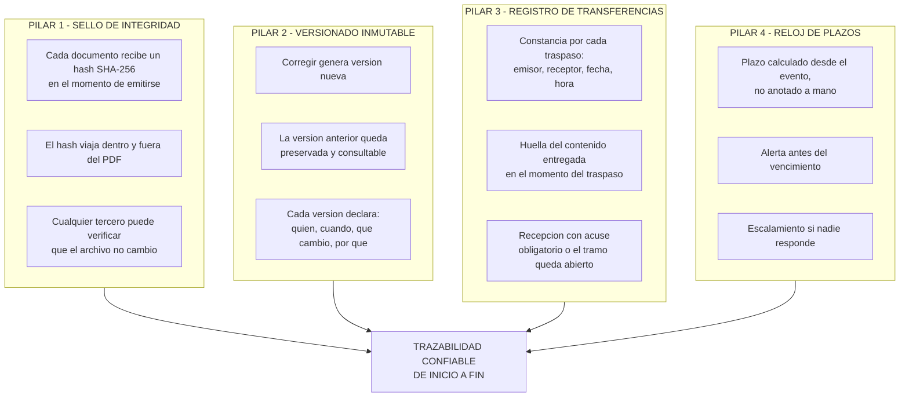
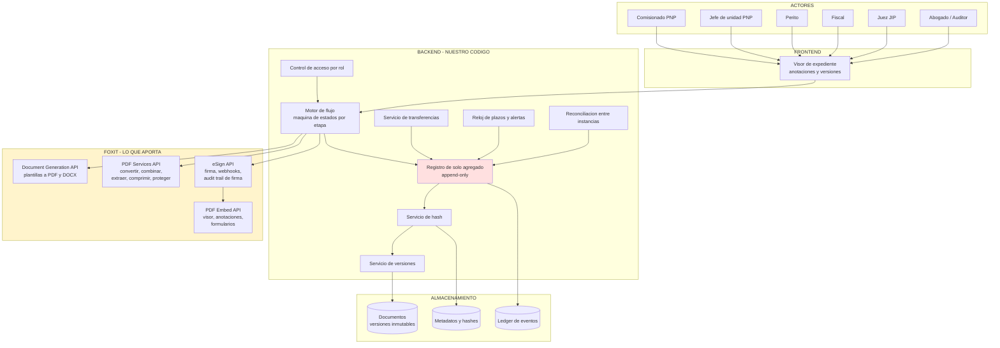
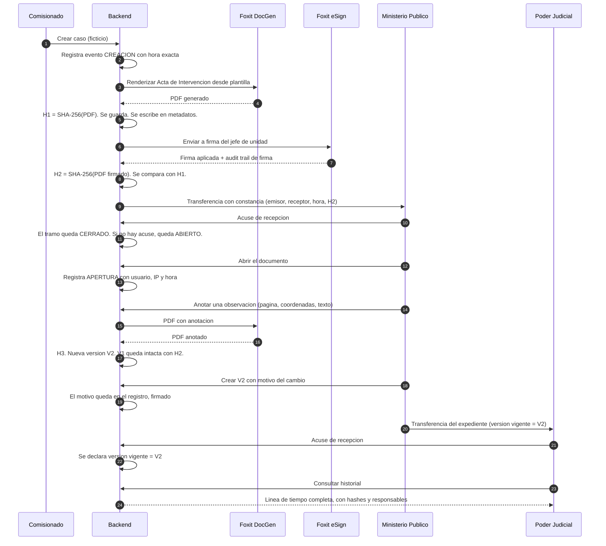

# ARQUITECTURA DE LA CAPA DE TRAZABILIDAD

Carpeta: `02_SOLUCION_FOXIT`
Documento: 01 de 05
Estado: diseño propuesto. No implementa Foxit todavía.

---

## 1. PRINCIPIO RECTOR

> **Nunca se reemplaza un documento en silencio.**

Esa frase es la base de todo. Si un documento cambia, el sistema crea una versión nueva y conserva la anterior. Si un documento se transfiere, el sistema deja constancia de quién lo recibió, cuándo y con qué huella. Si un plazo corre, el sistema avisa antes de que venza.

**No se reemplaza nada de lo que ya existe.** La PNP sigue usando sus sistemas, el Ministerio Público sigue usando los suyos, el Poder Judicial sigue usando los suyos. La capa va encima, como un notario que registra cada movimiento.

---

## 2. LOS CUATRO PILARES

Cada pilar responde a un punto de quiebre concreto del documento `01_PROBLEMA/01_GESTION_DE_CASO_REAL_EN_PERU.md`.

### Pilar 1 — Sello de integridad

Un PDF es texto plano comprimido. Cambiar una fecha dentro de un PDF es trivial y no deja rastro. Por eso el hash se calcula **en el momento exacto de la emisión** y se guarda en un registro que nadie más escribe.

**Foxit aporta:** generación del PDF final desde plantilla, conversión, y las operaciones que dejan el documento en un estado final reproducible.

**El backend aporta:** el cálculo del hash, su almacenamiento y la posibilidad de que un tercero lo verifique. Foxit no es un almacén de hashes.

### Pilar 2 — Versionado inmutable

El problema actual es que una corrección legítima destruye el original. Con este pilar, el fiscal que observa un error crea la versión 2 y la versión 1 sigue disponible, con su hash intacto.

**Foxit aporta:** el PDF de la versión nueva y, si se requiere, la combinación de documentos.

**El backend aporta:** la cadena de versiones, el motivo del cambio y la garantía de que la versión antigua no se sobrescribe. Eso es base de datos, no Foxit.

### Pilar 3 — Registro de transferencias

Es la pieza que hoy no existe. Cuando la policía entrega el expediente a la Fiscalía, se firman dos folios y ambos archivan su copia. Nunca se cruzan. Cuando algo falta, se entera el juez.

Con este pilar, **cada traspaso genera una constancia con hora exacta y huella del contenido**, y la recepción es un acto explícito.

**Foxit aporta:** el acta de remisión como PDF generado, firmado y con sello de tiempo.

**El backend aporta:** la constancia del traspaso, la huella y el estado abierto o cerrado del tramo.

### Pilar 4 — Reloj de plazos

La causa número uno de libertad es un plazo que vence porque nadie lo estaba mirando. Este pilar calcula el vencimiento desde el evento que lo origina y avisa antes.

**Foxit no aporta nada aquí.** Esto es íntegramente backend, y hay que decirlo con claridad ante Foxit. El valor es que el resto de los pilares hace que ese reloj sea confiable.

---

## 3. DIAGRAMA DE ARQUITECTURA

**El bloque rojo es el corazón.** Foxit es el motor que produce y firma los documentos. El registro de solo agregado es la memoria que permite probar quién hizo qué. Si se quita Foxit, el producto pierde la capacidad de producir y firmar. Si se quita el registro, el producto pierde la capacidad de probar.

---

## 4. FLUJO DE EXTREMO A EXTREMO

Un caso completo, con lo que ocurre en cada paso.

### Lo que el juez puede reconstruir al final

Sin pedirle el favor a nadie, sin confiar en la buena memoria de nadie:

- El acta que firmó la policía en T0 tiene hash H1 y no cambió.
- El fiscal la abrió a las 11:02 desde la IP X.
- La anotación de las 11:08 está en la página 3.
- La versión 2 fue creada a las 11:15 con motivo "corrección de hora de la detención".
- La versión 1 sigue disponible y verifica contra H2.
- El expediente llegó al juzgado a las 11:30 con la versión 2 como vigente.
- El tramo de transferencia tiene acuse con hora, o está marcado abierto.

---

## 5. REPARTO DE RESPONSABILIDADES (lo que Foxit hace y lo que no)

Esta tabla es la que hay que mostrar a Foxit con honestidad. El error que mata una propuesta es atribuirle a Foxit cosas que no hace.

| Capacidad | Foxit lo hace | Nuestro backend lo hace |
|---|---|---|
| Crear el PDF desde una plantilla oficial | **Si.** Document Generation API, plantillas a PDF y DOCX | Define el contenido y la estructura de datos |
| Convertir, combinar, extraer, comprimir, proteger | **Si.** PDF Services API | Decide cuándo y con qué parámetros |
| Firmar electrónicamente y notificar | **Si.** eSign API, con webhooks | Autoriza quién firma y sobre qué versión |
| Obtener el registro de la firma | **Si.** Audit trail de eSign con identidad, fecha, IP y método de autenticación | Lo copia a nuestro registro propio, para que no dependamos del proveedor |
| Ver si un PDF cambió desde que se emitió | No | **Si.** Comparación de hashes |
| Preservar la versión anterior sin sobrescribirla | No | **Si.** Almacenamiento inmutable |
| Saber por qué se creó una versión nueva | No | **Si.** Campo de motivo, firmado |
| Registrar quién recibió el expediente y cuándo | No | **Si.** Constancia de transferencia con acuse |
| Calcular el vencimiento de un plazo y alertar | No | **Si.** Reloj de plazos |
| Reconciliar lo que tiene la PNP, lo que tiene el MP y lo que tiene el PJ | No | **Si.** Motor de reconciliación |
| Ver el documento con anotaciones dentro de la app | **Si.** PDF Embed API | Define qué anotaciones se permiten |
| Impedir que alguien vea un caso que no le corresponde | No | **Si.** Control de acceso por rol |

> **Frase para la presentación:** Foxit es el tallo. Somos la raíz. Sin raíz no hay árbol, pero el árbol no es raíz.

---

## 6. CAPAS DE CONFIANZA

Cada capa responde una pregunta distinta, y ninguna refuerza a la anterior.

| Capa | Pregunta que responde | Mecanismo |
|---|---|---|
| **Integridad** | ¿El archivo que tengo es el que se emitió? | Hash SHA-256 al momento de emisión |
| **Autenticidad** | ¿Quién lo firmó? | Audit trail de eSign con identidad, IP, fecha y método |
| **Version** | ¿Cuál es la vigente? ¿Existía la anterior? | Cadena de versiones con motivo |
| **Trazabilidad** | ¿Quién lo tuvo, cuándo y por qué? | Constancia de transferencia con acuse |
| **Temporalidad** | ¿El plazo vence? ¿Cuánto falta? | Reloj de plazos con alerta y escalamiento |
| **Reconciliación** | ¿Los tres sistemas dicen lo mismo? | Comparación de hashes entre instancias |

---

## 7. LO QUE ESTE DISEÑO NO HACE

| No hace | Por qué |
|---|---|
| No reemplaza la PNP, el MP ni el Poder Judicial | Es una capa encima. Si los reemplazara, nadie la adoptaría. |
| No decide culpabilidad | Ni ninguna IA, ni un humano, ni un software. |
| No usa datos reales | La demostración es con datos ficticios, marked como prototipo. |
| No inventa plazos | Los plazos vienen del NCPP. El sistema los calcula, no los crea. |
| No es un expediente electrónico | No reemplaza el EJE. Es la capa de integridad y trazabilidad que falta. |
| No archiva en nombre de nadie | El archivo institucional sigue donde está. Nosotros preservamos el historial. |

---

*Documento 01 de 05. Siguiente: `02_MATRIZ_QUIEBRE_CONTROL.md`.*
