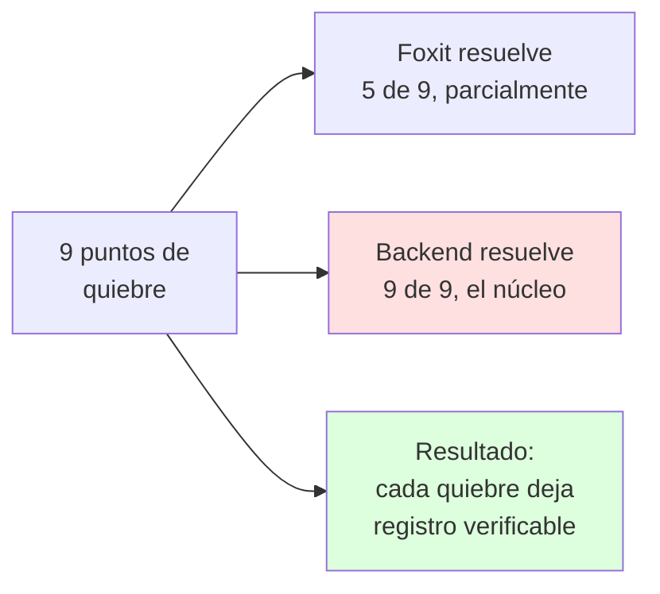

# MATRIZ: PUNTO DE QUIEBRE Y CONTROL

Carpeta: `02_SOLUCION_FOXIT`
Documento: 02 de 05

Esta matriz toma los **9 puntos de quiebre** del documento `01_PROBLEMA/01_GESTION_DE_CASO_REAL_EN_PERU.md` y muestra, uno por uno, qué lo cierra.

Leyenda de la columna Foxit:
- **Si** = lo hace la API de Foxit
- **No** = lo hace nuestro backend, y hay que decirlo con claridad
- **Parcial** = Foxit cubre una parte

---

## 1. VISTA GENERAL

| # | Punto de quiebre | Pilar que lo cierra | Foxit | Backend |
|---|---|---|---|---|
| 1 | Noticia derivada a la mesa equivocada | 3 + 4 | No | **Si** |
| 2 | Depósito de la denuncia sin constancia | 1 + 3 | Parcial | **Si** |
| 3 | Plazo a la policía mal calculado | 4 | No | **Si** |
| 4 | Cadena de custodia rota | 1 + 3 | Parcial | **Si** |
| 5 | Remisión al juez sin constancia | 3 | Parcial | **Si** |
| 6 | Auto de formalización vence | 4 | No | **Si** |
| 7 | Nulidad por vicio formal | 1 + 2 | Parcial | **Si** |
| 8 | Prisión preventiva no solicitada | 4 | No | **Si** |
| 9 | Notificaciones y citaciones fallidas | 2 + 3 | Parcial | **Si** |

> **Seis de nueve no los resuelve Foxit.** Y eso está bien, porque es exactamente lo que hay que decirle a un equipo técnico: no estamos vendiendo humo, estamos diciendo dónde está el valor y dónde está el trabajo de integración.

---

## 2. QUIEBRE POR QUIEBRE

### Quiebre 1 — La noticia llega a la mesa equivocada

**Qué pasa hoy:** el expediente se deriva a una mesa de partes que no corresponde. El reloj ya corre desde T0, así que el error se paga en plazos, no en tiempo.

**Qué lo cierra:**
- La derivación se registra como evento con emisor, receptor, fecha y **hora exacta**.
- El tramo queda en estado **ABIERTO** hasta que el receptor acepta.
- Si el receptor no acepta en el plazo, la alerta sube al supervisor de la mesa.

| Parte | Quién |
|---|---|
| PDF del acta de derivación, firmado | Foxit |
| Registro del tramo abierto, huella del contenido, alerta de no-recepción | Backend |

---

### Quiebre 2 — El depósito de la denuncia no deja constancia

**Qué pasa hoy:** no hay registro de quién recibió, cuándo ni con cuántos folios. Nadie sabe en qué despacho está el expediente.

**Qué lo cierra:**
- Constancia de depósito obligatoria con: usuario receptor, institution, fecha, **hora al minuto**, número de folios, **hash del contenido recibido**.
- La constancia se firma y queda disponible para el receptor.
- Si el receptor no confirma la recepción con su propia huella, la constancia queda incompleta y salta la alerta.

| Parte | Quién |
|---|---|
| PDF de la constancia de depósito, generado y firmado | Foxit |
| Número de folios, hash del contenido, estado de confirmación | Backend |

**Por qué esto importa tanto:** es el primer punto donde el expediente se vuelve demostrablemente rastreable. Todo lo que viene después depende de que el T0 quede fijado con hora y contenido.

---

### Quiebre 3 — El plazo a la policía está mal calculado

**Qué pasa hoy:** el fiscal otorga 8 horas, la policía necesita 12, vence por 4 horas y se nulifica todo lo actuado.

**Contexto verificado:** el Reglamento de la Fiscalía exige que el plazo a la unidad policial sea *"razonable antes de su vencimiento"* o *"estrictamente necesario"*.

**Qué lo cierra:**
- El plazo se registra como dato estructurado, no como texto en un documento.
- El sistema **calcula** el vencimiento desde el evento que lo origina y **avisa antes**.
- Si el tramo se acerca al límite sin documento de cierre, salta alerta al supervisor.

| Parte | Quién |
|---|---|
| Nada | Foxit no participa |
| Cálculo del vencimiento, alerta, escalamiento | **Backend** |

> **Este es el punto donde la trazabilidad se convierte en libertad humana preservada.** Y es 100% backend. Hay que decirlo así.

---

### Quiebre 4 — La cadena de custodia se rompe

**Qué pasa hoy:** la evidencia pasa por cinco manos en cinco documentos distintos. Un sello mal puesto equivale a prueba perdida, y no hay forma de probarlo en contra.

**Qué lo cierra:**
- **Acta de entrega y recepción por cada traspaso**, generada desde plantilla oficial y firmada por ambos.
- **Hash del bien o del documento en cada traspaso.** Si el contenido cambia entre un traspaso y otro, la comparación lo delata.
- El registro muestra la **línea de tiempo completa de la evidencia**: quién la tuvo, cuándo y cuánto tiempo.

| Parte | Quién |
|---|---|
| PDF del acta de entrega y recepción, firmado por emisor y receptor | Foxit |
| Hash por traspaso, línea de tiempo de la evidencia, alerta de discrepancia | **Backend** |

**Regla verificada que hay que respetar:** el informe pericial **no puede contener juicios de responsabilidad penal**, y el perito de parte tiene **5 días** para designarse. La capa debe permitir esos flujos, no bloquearlos.

---

### Quiebre 5 — La remisión al juez no deja constancia

**Qué pasa hoy:** el expediente pasa del fiscal al juez sin constancia. Si algo falta, se entera el juez, no los operadores.

**Qué lo cierra:**
- **Constancia de remisión** con lo que se entrega: número de documentos, versiones, folios y **hash de cada uno**.
- Acuse del receptor. Sin acuse, el tramo queda abierto y visible.

| Parte | Quién |
|---|---|
| PDF de la constancia de remisión y del acuse, firmados | Foxit |
| Manifiesto de documentos y versiones, hashes, estado del tramo | **Backend** |

**El manifiesto es la pieza clave.** No es un PDF con una lista: es una estructura de datos que dice exactamente qué versión de qué documento viaja. Si algo llega con una versión que no es la declarada, salta la alerta antes de que el juez abra el expediente.

---

### Quiebre 6 — El auto de formalización vence

**Qué pasa hoy:** el fiscal no formaliza dentro del plazo, el caso se archiva y el detenido sale libre. Nadie responde porque nadie fue alertado.

**Qué lo cierra:**
- El vencimiento se calcula desde el evento que lo origina y **se avisa antes**.
- Si el plazo vence sin el documento correspondiente, el sistema **registra el vencimiento con su causa** y escala al Fiscal Superior.
- El registro muestra el tramo completo: quién tuvo el caso, quién debía actuar, quién fue avisado y cuándo.

| Parte | Quién |
|---|---|
| Nada | Foxit no participa |
| Cálculo, alerta, escalamiento, registro del vencimiento | **Backend** |

> **Esto responde directo al problema del usuario:** el detenido no se libera por decisión de nadie, se libera por una omisión que hoy no deja rastro. Con registro, la omisión tiene nombre, hora y consecuencia.

---

### Quiebre 7 — Nulidad por vicio formal, el reloj se reinicia

**Qué pasa hoy:** el juez declara nulos los actos y remite al fiscal. El plazo se duplica, y la nulidad se usa como estrategia.

**Qué lo cierra:**
- La nulidad se registra como evento con su fundamento.
- El nuevo plazo se **recalcula automáticamente** desde la fecha de la resolución, no desde una anotación.
- La versión anterior de los documentos nulos queda **preservada**. Si se retoman, se recupera desde el historial.

| Parte | Quién |
|---|---|
| PDF de la resolución con anotación de nulidad | Foxit |
| Registro de nulidad, recálculo de plazo, preservación de la versión anterior | **Backend** |

> **El recálculo automático del plazo es la diferencia entre un sistema que registra y uno que evita el problema.**

---

### Quiebre 8 — La prisión preventiva no se solicita a tiempo

**Qué pasa hoy:** la formalización llega tarde, ya no hay margen para pedir la prisión preventiva, la audiencia pasa sin requerimiento y hay libertad.

**Qué lo cierra:**
- El sistema conoce **la fecha límite para solicitar la prisión preventiva**, calculada desde la formalización.
- Avisa con antelación suficiente.
- Si la fecha límite pasa sin requerimiento, se registra como evento crítico, visible para el supervisor.

| Parte | Quién |
|---|---|
| PDF del requerimiento de prisión preventiva y del auto, firmados | Foxit |
| Cálculo de la fecha límite, alerta previa, registro del incumplimiento | **Backend** |

---

### Quiebre 9 — Notificaciones y citaciones fallidas

**Qué pasa hoy:** el expediente se pierde, se cita a un domicilio equivocado, la audiencia no tiene quórum, y nadie asume el riesgo.

**Qué lo cierra:**
- **Bitácora de notificaciones**: quién fue notificado, cuándo, con qué documento, con qué hash.
- Alerta si una notificación **no fue entregada o fue devuelta**.
- **Historial de versiones consultable** por el notificado, para que pueda impugnar si algo cambió.

| Parte | Quién |
|---|---|
| PDF de la notificación, firmado | Foxit |
| Bitácora de notificaciones, alertas de devolución, historial de versiones | **Backend** |

---

## 3. RESUMEN DE LA MATRIZ

### Las seis cosas que Foxit aporta, resumidas

| Aporte de Foxit | En qué cierre |
|---|---|
| Generar el PDF desde plantilla oficial | 1, 2, 3, 4, 5, 6, 7, 8, 9 |
| Firmar y obtener registro de firma con identidad, IP y fecha | Todos los que requieren firma |
| Convertir, combinar, proteger, extraer | Procesamiento entre etapas |
| Visor con anotaciones dentro de la app | 7, 9 |
| Webhooks de eventos de firma | Actualización del registro |
| Presión institucional real | **El argumento completo** |

> **Lo último no es una broma y es lo más importante.** Si un producto se vuelve obligatorio para el proceso penal en el Perú, la conexión de red se cae. Un expediente que no se puede firmar se detiene. Foxit es infraestructura crítica: eso tiene implicaciones de contrato, de soporte y de responsabilidad que ninguna API de hash tiene.

---

*Documento 02 de 05. Siguiente: `03_TODO_QUEDA_GRABADO.md`.*
