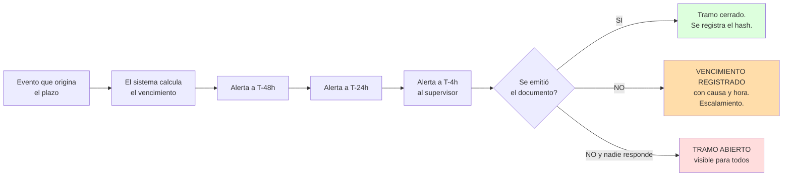
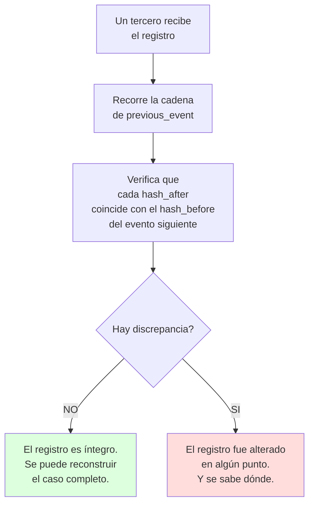

# TODO QUEDA GRABADO: RENDICIÓN DE CUENTAS

Carpeta: `02_SOLUCION_FOXIT`
Documento: 03 de 05

Este documento responde a la pregunta central: **¿cómo se demuestra quién falló cuando alguien sale libre?**

---

## 1. EL REGISTRO DE SOLO AGREGADO

El corazón del sistema no es Foxit. Es una tabla donde **solo se inserta, nunca se modifica ni se borra**.

### Qué contiene cada evento

| Campo | Tipo | Por qué existe |
|---|---|---|
| `event_id` | Identificador único | Referencia unívoca del evento |
| `timestamp_utc` | Fecha y hora con zona | **El reloj no depende del equipo del operador** |
| `actor_id` | Usuario que actuó | Quien |
| `actor_role` | Rol institucional | Con qué facultad |
| `institution` | Entidad | PNP, Fiscalía, Poder Judicial |
| `case_id` | Expediente | A qué caso pertenece |
| `event_type` | Tipo | Creación, apertura, anotación, transferencia, firma, vencimiento |
| `document_id` | Documento afectado | Sobre qué documento |
| `document_version` | Versión | Cuál versión específicamente |
| `hash_before` | Huella previa | Estado anterior verificado |
| `hash_after` | Huella nueva | Estado resultante |
| `plazo_id` | Plazo relacionado | Si el evento cierra o posterga un plazo |
| `motivo` | Texto del motivo | **Obligatorio** si se crea una versión nueva |
| `origen` | Sistema que originó | Para auditar qué llegó desde aquí |
| `destino` | Sistema destino | Para auditar adónde fue |
| `previous_event` | Evento anterior encadenado | **Cadena: el registro no se puede reordenar sin romper el hash** |

### Por qué "solo agregado" y no "modificable"

Un log que se puede editar no es evidencia. Es una opinion con fecha. La diferencia entre ambos:

| Log modificable | Registro de solo agregado |
|---|---|
| Puedes corregir un error y nadie lo nota | Cada corrección es un evento nuevo que **hereda** el anterior |
| Puedes borrar el evento que te incrimina | Borrar rompe la cadena y la detección es inmediata |
| El orden puede cambiarse | El orden está fijado por `previous_event` |
| Solo lo ve quien tiene acceso al sistema | **Un tercero puede recibir el registro completo y verificarlo** |

> **El argumento para el juez:** no necesitas que el Fiscal me quiera dar la verdad. Necesito que el sistema le dé la verdad a todos por igual, y que no pueda cambiarla sin que se note.

---

## 2. EL RELOJ DE PLAZOS

La causa número uno de libertad no es una decisión: es un vencimiento silencioso.

### Cómo funciona



### Dónde vive cada plazo

Los plazos no se escriben en un documento. Se **derivan de eventos verificables**:

| Plazo | Se origina en | Vencimiento | Fuente |
|---|---|---|---|
| Disposición de preliminares | Momento en que el fiscal tiene conocimiento formal | 24 h con detenido, 48 h sin detenido | **VERIFICADO** |
| Plazo a la unidad policial | Fecha y hora de la disposición | El que el fiscal escribió | **VERIFICADO** (Reglamento de la Fiscalía) |
| Auto de formalización | Cierre de preliminares | 10 días hábiles | **VERIFICAR** |
| Remisión al juez | Fecha del auto de formalización | 5 días | **VERIFICAR** |
| Designación de perito de parte | Notificación del perito oficial | 5 días | **VERIFICADO** |
| Pronunciamiento del perito oficial | Informe discrepante del perito de parte | 5 días | **VERIFICADO** |

> **Los plazos se calculan en días hábiles.** El sistema tiene que tener el calendario de feriados oficiales y de la semana judicial. Si el cálculo difiere del que hace el operador, el sistema muestra ambos y explica por qué.

### La diferencia entre registrar el vencimiento y evitarlo

| Sin trazabilidad | Con trazabilidad |
|---|---|
| El plazo venció y nadie lo notó | El plazo venció y el sistema avisó tres veces |
| Nadie sabe quién debía actuar | El registro dice quién tenía el tramo |
| Nadie sabe si se avisó | El registro dice a quién se avisó, cuándo y por qué canal |
| El caso se archiva | El archivo queda registrado **con su causa y su hora** |
| Nadie responde | La omisión tiene nombre |

---

## 3. RENDICIÓN DE CUENTRAS: EL CASO QUE SE ROMPE

Imaginemos el caso que describiste: **alguien deja libre a un detenido y nadie se hace responsable.**

### Lo que pasa hoy

```
Día 1, 10:32   Flagrancia. Se detiene a una persona.
Día 1, 11:00   Acta de intervención. Se entrega al fiscal.
Día 1, 11:05   El fiscal coloca el expediente en un cajón.
               El plazo corre. Nadie lo tiene anotado.
Día 1, 11:06   El fiscal se muda de despacho.
Día 4          El expediente aparece en otro escritorio.
Día 8          Vencen los plazos de preliminares.
Día 9          El fiscal revisa el expediente.
               Ya no hay nada que hacer. Dispone el archivo.
Día 9          El detenido sale libre.
```

**El resultado:** el detenido estuvo detenido 8 días y salió libre sin que nadie hubiera decidido que saliera. No hay documento que diga quién falló. Hay una carpeta con fechas, y las fechas no hablan.

### Lo que pasa con la capa

```
Día 1, 10:32   CREACION registrada. T0 fijado con hora exacta.
Día 1, 11:00   Acta generada desde plantilla. Hash H1 calculado.
               Firma del jefe de unidad. H2 = SHA-256(PDF firmado).
Día 1, 11:05   TRANSFERENCIA a la Fiscalía registrada.
               Tramo ABIERTO. H2 viajando.
Día 1, 11:06   RECEPCIÓN con acuse. Tramo CERRADO.
               Vencimiento calculado: Día 2, 11:05.

Día 1, 13:00   ALERTA T-22h al fiscal.
Día 2, 07:05   ALERTA T-4h al fiscal y a su supervisor.
Día 2, 11:05   VENCIMIENTO. Registrado con causa.
               Escalamiento automático al Fiscal Superior.

Día 2, 14:00   El fiscal emite la disposición fuera de plazo.
               El registro dice: "emitida 26 horas 55 minutos tarde".
               La nulidad es visible antes de que ocurra.

Día 4          El expediente es auditado.
               ¿Quién tenía el tramo? El fiscal, desde el Día 1, 11:06.
               ¿Quién fue avisado? Él mismo y su supervisor, dos veces.
               ¿Quién no actuó? Está escrito.
```

**El resultado:** el detenido sigue saliendo libre, porque la ley dice que un plazo vencido no se salva. Pero ahora **la responsabilidad es verificable y la corrección es posible a tiempo**, porque las alertas llegaron antes del vencimiento.

> **Esa es la diferencia que hay que defender ante Foxit y ante las instituciones:** la capa no garantiza que nadie salga libre. Garantiza que **nadie sale libre sin que quede registrado por qué**, y que la próxima vez el plazo no se vence.

---

## 4. ¿QUÉ SE CONSERVA Y POR CUÁNTO?

| Elemento | Conservación | Razón |
|---|---|---|
| Versiones de documentos | Permanente, inmutable | Presunción de inocencia y derecho a impugnar |
| Registro de eventos | Permanente | Es la evidencia de la responsabilidad |
| Hashes | Permanente | Sin ellos, el registro no prueba nada |
| Plazos vencidos | Permanente | Es el patrón que permite detectar fallas sistémicas |
| Datos personales | Solo lo necesario | Datos personales sensibles bajo la ley peruana |
| Metadatos técnicos | 5 años | Investigación de incidentes |

### Lo que NO se guarda

| No se guarda | Por qué |
|---|---|
| Contenido de mensajes entre fiscales | No es parte del expediente |
| Anotaciones personales del operador | No son parte del expediente |
| Biometría que no tenga fundamento legal | Principio de necesidadidad |

---

## 5. LO QUE UN TERCERO PUEDE HACER SIN NUESTRO SISTEMA

Esta es la parte que convierte el registro en evidencia y no en marketing.



**Sin la capa de Foxit, este diagrama no se puede hacer con un PDF.** Un PDF es texto plano. Un registro encadenado de eventos con hash no lo es.

---

## 6. LA PRUEBA DE FUEGO

Antes de sostener esto ante una institución, hay que responder cinco preguntas. Si alguna falla, la propuesta no sirve:

| # | Pregunta | Respuesta honesta |
|---|---|---|
| 1 | ¿El registro resiste una auditoría externa? | Sí, si se entrega completo y el tercero tiene los hashes. **Debe probarse en la demo.** |
| 2 | ¿Se puede usar para sancionar a un fiscal? | **No.** El registro muestra hechos, no responsabilidad administrativa. Esa es una decisión de una autoridad, no de un software. |
| 3 | ¿Y para impugnar una prueba? | **Sí.** Un peritaje cuya cadena de custodia tiene un hueco es impugnable. |
| 4 | ¿Funciona si Foxit se cae? | **Parcialmente.** Se conservan los documentos y el registro, pero no se pueden emitir nuevos. Por eso hay que hablar de continuidad. |
| 5 | ¿Es realmente todo lo que el usuario pidió? | **Casi.** El registro hace probable la identificación del responsable, no la certeza. Prometer certeza sería mentir. |

> **La honestidad de la fila 2 es la que hace creíble todo lo demás.** Un sistema que promete sancionar a fiscales desde un software es un sistema que nadie adopta.

---

*Documento 03 de 05. Siguiente: `04_IMPLEMENTACION_OBLIGATORIA.md`.*
