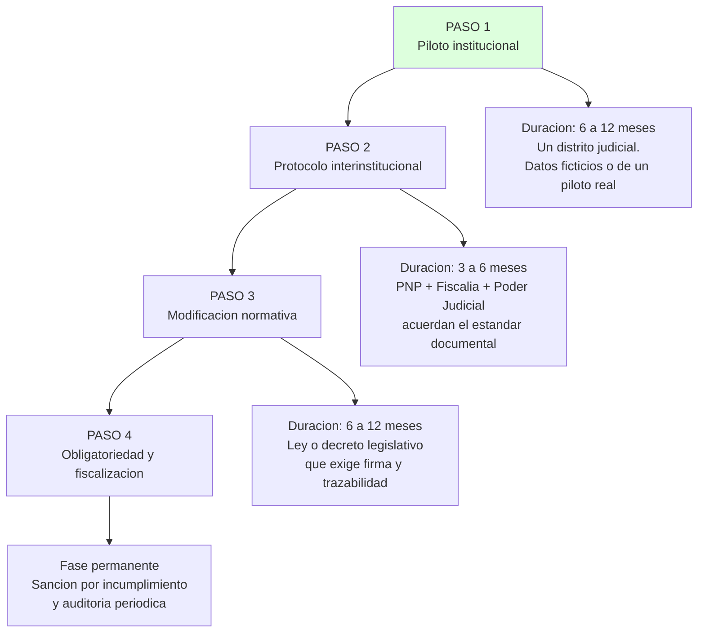

# IMPLEMENTACIÓN OBLIGATORIA: QUÉ PASA SI FOXIT SE VUELLE REQUISITO

Carpeta: `02_SOLUCION_FOXIT`
Documento: 04 de 05

Este documento responde a la pregunta que cambia el proyecto de un MVP a una propuesta institucional:

> **Si el proceso penal peruano exigiera que todo documento del expediente lleve firma electrónica, sello de tiempo y trazabilidad verificable, ¿qué pasaría con Foxit?**

---

## 1. POR QUÉ ESTE ESCENARIO NO ES UNA FANTASÍA

Perú ya tiene normas que apuntan en esa dirección:

| Norma | Qué habilita | Estado |
|---|---|---|
| **Ley N.° 27287** — Ley de Firmas y Certificados Digitales | Reconoce la firma electrónica y la firma digital como medios válidos de documentación | **VERIFICAR** vigencia y requisitos |
| **Ley N.° 27844** — Sistema Nacional de Archivos | Principio de Gestión Documental, incluyendo conservación y trazabilidad | **VERIFICAR** |
| **Ley N.° 28411** — Ley General del Sistema Nacional de Archivos | Marco del sistema de archivos del Estado | **VERIFICAR** |
| **Ley N.° 29733** — Protección de Datos Personales | Datos personales sensibles; el expediente penal lo es | **VERIFICAR** |
| **ISO 15489** — Gestión de documentos | Estándar internacional de gestión documental | Referencia técnica, no ley |
| **ISO/IEC 27001 y SOC 2** | Certificaciones que Foxit declara tener | Declarado por el proveedor, **auditar** |
| **Expediente electrónico judicial (EJE)** | El Poder Judicial ya tiene un sistema electrónico | Existe, pero **no resuelve** la cadena entre PNP, Fiscalía y Poder Judicial |

> **El hueco institucional está identificado:** existen sistemas electrónicos en cada institución, pero **nadie es dueño del recorrido completo**. Cada uno tiene su versión de la verdad y nadie las reconcilia. Una capa de trazabilidad es exactamente el complemento que falta.

---

## 2. QUÉ CAMBIARÍA SI FUERA OBLIGATORIO

### 2.1 Para el operador

| Antes | Después |
|---|---|
| Acta en papel, escaneada cuando se puede | Acta generada desde plantilla oficial, firmada digitalmente, con hash desde el momento de emisión |
| Corrección sobre el mismo archivo | Cada corrección genera versión nueva; la anterior se conserva |
| Transferencia firmada en dos folios | Constancia de transferencia con hora exacta, huella del contenido y acuse del receptor |
| Plazo anotado en cuaderno | Reloj calculado, con alerta antes del vencimiento |
| "¿En qué despacho está el expediente?" | La respuesta es un registro, no una búsqueda |

### 2.2 Para la institución

| Antes | Después |
|---|---|
| La responsabilidad está difusa entre tres instituciones | La responsabilidad es verificable por tramo |
| Los 시스템 de cada institución no se hablan | Una capa común reconcilia las tres afirmaciones |
| Un expediente perdido es un expediente perdido | Un expediente perdido es un evento registrado, y se sabe en qué tramo |
| No se puede reconstruir "qué había antes" | El historial es completo y verificable por un tercero |

### 2.3 Para Foxit

| Antes | Después |
|---|---|
| Proveedor de herramientas de PDF | **Infraestructura crítica para el proceso penal** |
| Competencia con otras herramientas de PDF | Sin competencia directa: la capa se define sobre Foxit |
| Consumo por licencia | Consumo obligatorio, recurrente, por volumen de expedientes |
| Dependencia del cliente individual | Dependencia institucional, con contrato y soporte |

---

## 3. LA RUTA NORMATIVA

Esto no se cambia con una decisión administrativa. Hay cuatro pasos, y ninguno es nuestro.

### Paso 1 — Piloto institucional

**Qué:** un solo distrito judicial, un solo tipo de delito, la capa funcionando sobre los sistemas existentes.

**Por qué primero:** porque el mayor riesgo no es técnico, es de **adopción**. Un piloto que falla porque la PNP no quiere cambiar su forma de trabajar no sirve de nada, aunque el código sea perfecto.

**Lo que hay que demostrar:**
- La capa no obliga a cambiar de sistema. Se usa **encima**.
- El tiempo de uso adicional es menor a 5 minutos por documento.
- Cuando algo falla, el registro lo muestra sin culpar a la persona.

### Paso 2 — Protocolo interinstitucional

**Qué:** las tres instituciones firman un protocolo que define el estándar documental: qué documentos existen, qué campos llevan, qué huella se registra, qué hora se usa.

**Aquí está el valor de Foxit:** un estándar que una sola empresa puede implementar es frágil. Un estándar donde Foxit es **el motor de implementación** y las instituciones son las que fijan las reglas, es más sólido.

### Paso 3 — Modificación normativa

**Qué:** una ley o decreto legislativo que exija que todo documento del expediente penal lleve firma electrónica, sello de tiempo y registro de trazabilidad verificable.

**VERIFICAR:** el Perú tiene proyectos de reforma procesal y de expediente electrónico en distintos tramos de discusión. Hay que revisar si alguno ya contempla la exigencia de firma y trazabilidad antes de proponerlo como algo nuevo.

### Paso 4 — Obligatoriedad y fiscalización

**Qué:** el incumplimiento se detecta y se sanciona. Sin este paso, la obligatoriedad es letra muerta.

**Y aquí aparece la dependencia:** el sistema tiene que saber qué documentos se emitieron y cuáles no. Eso solo es posible si **todo pasa por la capa**. De ahí la dependencia técnica.

---

## 4. EL ARGUMENTO QUE HACE VALER LA PROPUESTA

> **La trazabilidad no es un requisito técnico. Es un requisito de debido proceso.**

Cuando un detenido sale libre porque venció un plazo, ese direitos no se está violando a la ley: se está aplicando. El problema es que **nadie puede demostrar quién falló**. Y en un sistema donde nadie puede demostrar nada, nadie responde por nada.

Una capa de trazabilidad no evita los errores. Hace que:
- **los errores se detecten antes** (alertas de plazo),
- **los errores sean imputables** (registro de solo agregado),
- **los errores sean corregibles** (el plazo se recupera si no ha vencido),
- **los errores no se repitan** (los patrones de falla se pueden analizar).

Eso no es tecnicismo. Es el requisito de que una institución que decide sobre la libertad de las personas sea auditable.

---

## 5. LOS CINCO RIESGOS REALES

No hay que esconderlos. Un comité técnico los va a encontrar igual.

| # | Riesgo | Gravedad | Mitigación |
|---|---|---|---|
| 1 | **Falla de un solo proveedor.** Si Foxit se cae, el proceso penal se detiene. | **Alta** | Continuity: caché local de plantillas, cola de operaciones, y un modo degradado que permita seguir operando sin firma y marque el documento como pendiente de firma |
| 2 | **Dependencia tecnológica del Estado.** Una capa de trazabilidad que requiere un proveedor privado es una dependencia política. | **Alta** | Formato abierto (PDF/A), hash estándar, registro exportable. Que el registro sea legible sin Foxit |
| 3 | **Adopción.** La PNP, la Fiscalía y el Poder Judicial tienen resistencias previsibles. | **Alta** | Piloto antes de normativa. Mostrar que no reemplaza nada |
| 4 | **Rendimiento.** Si el sistema es lento, se abandona. | Media | Caching, procesamiento asíncrono, y medir desde el primer día |
| 5 | **Uso indebido.** Un registro detallado puede usarse para perseguir a los operadores en vez de para mejorar los casos. | Media | Definir con claridad que el registro sirve para encontrar fallas sistémicas, no para sancionar al que escribe |
| 6 | **Falsa expectativa.** Si se promete que el sistema evita la liberación de detenidos, se va a fallar públicamente la primera vez que un plazo venza. | **Alta** | **Decir desde el inicio:** el sistema no evita la liberación por ley; garantiza que no ocurra por omisión invisible |

### El riesgo 5 en detalle

Es el más peligroso y el más difícil de discutir. Un registro que dice exactamente quién hizo qué y cuándo puede usarse para dos cosas:

| Uso legítimo | Uso indebido |
|---|---|
| Detectar fallas sistémicas en el flujo | Perseguir al operador por un error de tipeo |
| Mejorar los plazos y la distribución de carga | Crear una cultura de miedo que haga que nadie quiera tomar decisiones |
| Fundamentar una investigación administrativa por un vacío probatorio | Usar el registro como excusa para no mejorar el proceso real |

**La mitigación es de diseño:** el registro debe mostrar **el flujo y sus fallas**, no calificar a las personas. La pregunta que el sistema responde es *"¿dónde falló el proceso?"*, no *"¿quién cometió el error?"*. La segunda pregunta la responde una autoridad, con debido proceso, y no un software.

---

## 6. QUÉ NECESITA FOXIT PARA ESTE ESCENARIO

Esto es lo que hay que plantear a Foxit como lo que el proyecto les **necesita**, no lo que les **damos**:

| Necesidad | Por qué |
|---|---|
| **Compromiso de disponibilidad contractual** | Si el proceso penal depende, hay que garantizar el servicio |
| **Acuerdo de nivel de servicio con soporte en horario extendido** | Un expediente no puede esperar al lunes |
| **Capacidad de operar en región cercana** | Los datos del expediente penal peruano no deberían salir del país |
| **Registro de auditoría exportable y de largo plazo** | Si el Estado guarda el registro, Foxit no es dueño de la evidencia |
| **Continuidad documentada ante caída de servicio** | Ver riesgo 1 |
| **Compromiso de no_training de datos para entrenamiento de modelos** | Dato penal sensible, con o sin IA en el futuro |
| **Formato de salida estándar (PDF/A)** | Para que el archivo exista sin Foxit |
| **Acompañamiento normativo y regulatorio** | Si se busca obligatoriedad, hace falta quien sepa empujar el proyecto |

> **Ese último punto es el argumento comercial más fuerte.** No estamos vendiendo licencias. Estamos ofreciendo ser el proveedor de infraestructura de un sector público, y eso abre la puerta a acuerdos de nivel de servicio que ninguna venta de herramientas puede igualar.

---

## 7. RIESGO LEGAL Y ÉTICO QUE DEBEMOS DECIR NOSOTROS MISMOS

| Riesgo | Declaración que hay que hacer |
|---|---|
| Legal | Este documento **no es asesoramiento legal**. La ruta normativa de la sección 3 tiene que ser validada por un abogado peruano antes de presentarse a una institución. |
| Alcance | La capa **no reemplaza ningún sistema existente** y **no toma decisiones sobre personas**. |
| Datos | Toda demostración usa datos **ficticios**, marcados como prototipo. |
| Expectativas | La capa **no garantiza** que nadie salga libre. Garantiza que no se salga libre **sin registro de por qué**. |
| Responsabilidad | El registro **no sanciona**. Muestra hechos; la sanción es de una autoridad, con debido proceso. |

---

*Documento 04 de 05. Siguiente: `05_ROADMAP_Y_ALCANCE.md`.*
