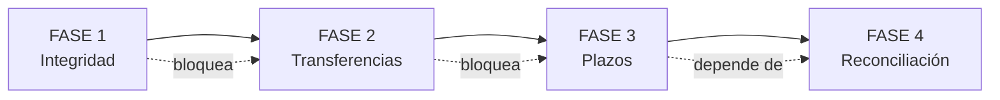

# ROADMAP Y ALCANCE

Carpeta: `02_SOLUCION_FOXIT`
Documento: 05 de 05

---

## 1. ORDEN DE CONSTRUCCIÓN

El orden no es por dificultad técnica. Es por **qué parte del argumento necesita ser demostrada primero**.

| Fase | Qué demuestra | Por qué va primero |
|---|---|---|
| **1. Integridad** | El documento que tengo es el que se emitió, y no se puede cambiar en silencio | Es la afirmación más simple y la más fuerte. Si falla esto, todo lo demás es decorativo. |
| **2. Transferencias** | Nadie puede decir "no sabía dónde estaba el expediente" | Es el punto de quiebre más frecuente y el más fácil de mostrar en demo |
| **3. Plazos** | El sistema avisa antes de que venza el plazo | Responde directo al problema que nos trajo aquí |
| **4. Reconciliación** | Los tres sistemas dicen lo mismo | Es la Fase 2. La más valiosa y la más difícil. |

---

## 2. MUST HAVE

Sin esto no hay MVP.

| # | Funcionalidad | Dónde entra Foxit |
|---|---|---|
| 1 | Generación de actas desde plantilla oficial | Document Generation API |
| 2 | Cálculo y registro de hash SHA-256 al emitir | Backend |
| 3 | Firma electrónica con registro de identidad, IP y fecha | eSign API |
| 4 | Versionado inmutable con motivo del cambio | Backend |
| 5 | Constancia de transferencia con acuse del receptor | PDF con DocGen + eSign, registro en backend |
| 6 | Registro de solo agregado con cadena de eventos | Backend |
| 7 | Visor con anotaciones sobre el PDF | PDF Embed API |
| 8 | Línea de tiempo del caso reconstruible | Backend, alimentado por las anteriores |
| 9 | Verificación de integridad por un tercero | Backend |
| 10 | Datos ficticios marcados como prototipo | --- |

---

## 3. SHOULD HAVE

| # | Funcionalidad | Dónde entra Foxit |
|---|---|---|
| 11 | Reloj de plazos con alerta | Backend |
| 12 | Manifiesto de documentos por versión en cada remisión | Backend + DocGen |
| 13 | Bitácora de notificaciones con estado de entrega | Backend + PDF generado |
| 14 | Exportación del registro completo para auditoría externa | Backend |
| 15 | Control de acceso por rol | Backend |
| 16 | Conversión a PDF/A para conservación de largo plazo | PDF Services API |

---

## 4. NICE TO HAVE

| # | Funcionalidad | Nota |
|---|---|---|
| 17 | Reconciliación entre los tres sistemas | Fase 2 del proyecto. Es el mayor valor y el mayor costo. |
| 18 | Línea de tiempo de la evidencia física | Requiere digitalizar la cadena de custodia |
| 19 | Panel de patrones de falla | Necesita volumen de datos reales |
| 20 | Integración con MCP Server de Foxit | Interesante, pero no aporta al argumento |
| 21 | Generación automática de informes de supervisión | Útil después del piloto |

---

## 5. QUÉ NO CONSTRUIR

| No construir | Por qué |
|---|---|
| Un expediente electrónico | Reemplazar el EJE es otro proyecto, de otra escala, y nadie lo va a adoptar |
| Gestión de usuarios completa | El MVP usa roles fijos. La gestión de identidades viene del directorio institucional |
| Cualquier decisión automatizada | Ni una regla, ni un score, ni una IA que sugiera plazos o decisiones |
| Integración profunda con sistemas existentes | Es el piloto lo que demuestra que no hace falta |
| Búsqueda de texto a escala | No aporta al argumento |
| App móvil | El operador judicial trabaja en escritorio |
| Multi-idioma | El proyecto es para el Perú |

---

## 6. PLAN DE 20 DÍAS

| Días | Hito | Entregable |
|---|---|---|
| 1-3 | Research y definición de flujo | Este documento, la matriz de quiebres, los plazos verificados |
| 4-6 | Arquitectura, modelo de datos, diseño de interfaz | Esquema de base de datos, pantallas, contrato de API propia |
| 7-9 | Núcleo: casos, documentos, versiones, hashes | Backend funcionando sin Foxit |
| 10-12 | Integración Foxit: DocGen, eSign, PDF Services | Plantillas reales, firma funcionando |
| 13-14 | Transferencias, acuses, reloj de plazos | Tramos con estado abierto y cerrado |
| 15-16 | Visor con anotaciones, línea de tiempo | PDF Embed funcionando |
| 17 | Verificación de integridad por tercero | Script de verificación ejecutable |
| 18-19 | Pruebas y guion de demo | Demo de 7 minutos grabada |
| 20 | Documentación y presentación | Este set de documentos |

---

## 7. LA DEMO EN 7 MINUTOS

| Minuto | Qué se muestra | Qué prueba |
|---|---|---|
| 0-1 | El problema, en una pantalla: la línea de tiempo de plazos | Que el problema es real y verificable |
| 1-2 | El oficial crea el caso y el acta se genera desde plantilla | Que Foxit genera el documento real |
| 2-3 | Firma del jefe de unidad, con hash H1 y registro de firma | Que la firma es verificable |
| 3-4 | Transferencia a la Fiscalía con constancia y acuse | Que el tramo tiene dueño y hora |
| 4-5 | El fiscal abre, anota en la página 3, crea versión 2 con motivo | Que corregir no borra el original |
| 5-6 | Se muestra que la versión 1 sigue intacta y verifica contra H2 | **El momento clave de la demo** |
| 6-7 | La línea de tiempo completa, con todos los hashes y responsables | Que todo queda grabado |

> **El minuto 5-6 es el que hay que proteger.** Si hay que recortar, se recorta antes y después, nunca ese minuto.

---

## 8. STACK RECOMENDADO

| Capa | Elección | Razón |
|---|---|---|
| Frontend | HTML y JavaScript, sin framework pesado | El visor ya lo da PDF Embed. Un framework agrega complejidad sin valor para la demo |
| Backend | Node.js | El código existente ya está en Node. Y el hash es una línea |
| Base de datos | SQLite para el MVP | Cero instalación. En producción, PostgreSQL |
| Autenticación | Simple, con roles fijos | La gestión de identidades la trae la institución |
| Almacenamiento | Sistema de archivos con nombres por hash | El hash **es** el nombre. Doble beneficio: recuperable y verificable |
| Foxit | DocGen + eSign + PDF Services + PDF Embed | Las cuatro APIs, cada una con su lugar |
| Despliegue | Un contenedor, un proceso | Que sea fácil de levantar en una reunión |
| Pruebas | Script de verificación de integridad ejecutable | Es parte de la demostración |

---

## 9. LO QUE YA EXISTE EN ESTE DIRECTORIO

Material de trabajo previo, reutilizable:

| Archivo | Qué es | Estado |
|---|---|---|
| `traceability_engine.js` | Motor de trazabilidad en Node | Revisar y reescribir limpio |
| `run_complete_pipeline.js` | Pipeline de generación completa | Revisar |
| `generate_acta_v1.js` | Generador del acta de intervención | Adaptar a Foxit DocGen |
| `build_police_acta_template.py` | Constructor de la plantilla de acta policial | Base para la plantilla oficial |
| `build_judicial_templates.py` | Constructor de plantillas judiciales | Base |
| `plantilla_*.docx` | Tres plantillas Word | Base para las plantillas de DocGen |
| `database.json` | Esquema de datos previo | Revisar contra el diseño |
| `index.html`, `server.js` | Interfaz y servidor previos | Reutilizar la estructura, reescribir la lógica |
| `ACTA_INTERVENCION_POLICIAL_V1.pdf` / `V2.pdf` | **Ya hay una V1 y una V2** | Ejemplo real del problema: dos versiones, hay que ver si la V1 se preservó |

> **La última fila es una nota de trabajo, no una crítica.** Si al abrir esos dos archivos la V1 ya no está disponible, es la demostración más directa del problema que vamos a resolver.

---

## 10. LO QUE FALTA HACER ANTES DE PRESENTAR

| # | Tarea | Por qué es bloqueante | Estado |
|---|---|---|---|
| 1 | Cerrar las 10 verificaciones legales del documento de problema | Un juez que diga "ese plazo no existe" destruye el argumento | Abierta |
| 2 | Verificar los endpoints y parámetros reales de Foxit con una cuenta de desarrollador | No se puede prometer una API no probada | **Cerrada** — ver [`06_ENDPOINTS_VERIFICADOS.md`](./06_ENDPOINTS_VERIFICADOS.md) |
| 2b | Pedir credenciales del portal eSign | Sin eSign no hay el hito de firma de la demo. `invalid_client` no es bug, es cuenta faltante | **Abierta, nueva** |
| 3 | Confirmar la región de almacenamiento de datos de Foxit | Dato penal peruano no debería salir del país | Abierta |
| 4 | Probar la verificación de integridad con un tercero real | Si no se puede auditar desde fuera, el argumento se cae | **Cerrada** — `verify_integrity.js` no importa el motor ni abre la base de datos |
| 5 | Escribir el caso de uso del piloto institucional | Es lo que convierte un MVP en propuesta | Abierta |

> **Lo que destapó la tarea 2.** El proyecto tenía tres hosts que no existen en DNS, entre ellos `api.foxitesign.com`. Toda la cadena de firma habría fallado en el escenario, por un error de una línea. La verificación de endpoints no era burocracia: era la diferencia entre una demo que corre y una que se rompe frente al juez.

---

## 11. RESUMEN EJECUTIVO PARA LA DIRECCIÓN DE FOXIT

> **El problema.** El expediente penal peruano se cumple en papel. El papel no tiene dueño, no tiene reloj y no tiene memoria. Cuando un plazo vence, la persona sale libre y nadie responde, porque no hay registro que muestre quién tenía el caso ni quién fue avisado.
>
> **La solución.** Una capa de trazabilidad que se superpone a los sistemas existentes sin reemplazarlos. Cuatro pilares: sello de integridad por documento, versionado inmutable, registro de transferencias con hora confiable, y reloj de plazos con alerta.
>
> **El papel de Foxit.** Genera los documentos desde plantillas oficiales, firma con registro de identidad, IP y fecha, y da el visor con anotaciones. **Seis de los nueve puntos de quiebre los resuelve Foxit parcialmente; el núcleo del registro es nuestro.** Decir esto con honestidad es lo que hace creíble el resto.
>
> **La consecuencia.** Si el proceso penal adoptara esto, Foxit deja de ser una herramienta de PDF y pasa a ser infraestructura crítica de un sector público. Eso cambia la relación comercial entera.
>
> **Lo que hay que construir primero.** Integridad. Después transferencias. Después plazos. Reconciliación después, en la fase 2.

---

*Documento 05 de 05. Volver al [índice](../00_INDICE.md).*
