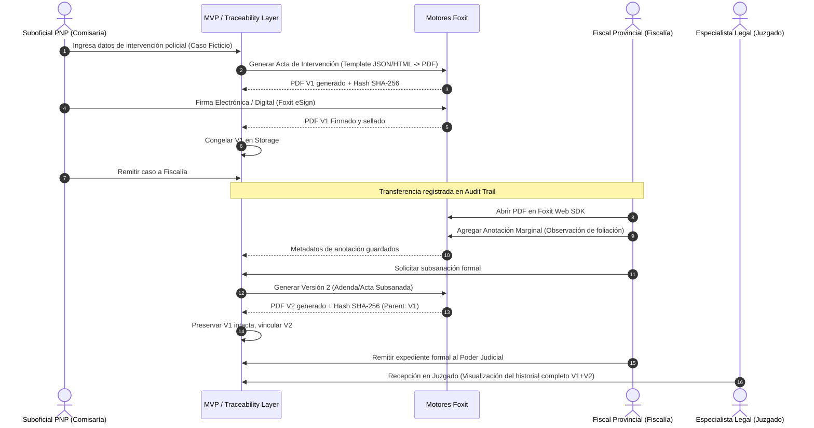

# PROPUESTA TÉCNICA: FOXIT CRIMINAL JUSTICE DOCUMENT TRACEABILITY (MVP)

**Destinatario:** Equipo Directivo & Soluciones de Arquitectura de Foxit  
**Enfoque:** Proof of Concept / Minimal Viable Product (MVP)  
**Alcance:** Capa complementaria de Integridad, Trazabilidad y Gestión Documental en Justicia Penal  
**Tiempo Estimado:** 20 días laborales  
**Presupuesto Estimado:** USD $600 – $1,200  

---

## A. Executive Summary

Este MVP demuestra cómo las tecnologías de Foxit resuelven la vulnerabilidad crítica de alteración, extravío y pérdida de trazabilidad documental en la justicia penal en América Latina, iniciando con un piloto enfocado en Perú (Policía Nacional $\rightarrow$ Ministerio Público $\rightarrow$ Poder Judicial). 

El proyecto **no busca construir un sistema judicial completo**, sino implementar una **capa ligera de trazabilidad documental (*Document Traceability Layer*)**. A través de la integración de Foxit Document Generation, Foxit PDF Web SDK y Foxit eSign, el sistema garantiza que ningún documento sea reemplazado silenciosamente (*Never silently replace a document*). Cada acta policial nace con metadatos de origen, firma digital y hash criptográfico; las anotaciones fiscales se preservan en capas trazables y cualquier modificación legítima crea una Versión 2 inmutable, reteniendo la Versión 1 intacta.

El MVP valida en una demo de 7 minutos que Foxit no es un simple visor, sino el motor central de confianza documental, integrable de forma no invasiva sobre sistemas legados.

*(Total palabras: 158)*

---

## B. Problem

En la transición operativa entre la Policía Nacional, el Ministerio Público (Fiscalía) y los Juzgados, los documentos físicos y archivos PDF tradicionales enfrentan serias brechas de seguridad:
1. **Riesgo de Reemplazo Silencioso:** PDFs escaneados o editados localmente pueden ser sustituidos en carpetas compartidas o correos sin dejar rastro de quién alteró el texto.
2. **Pérdida de Contexto en Anotaciones:** Cuando un fiscal detecta errores materiales u omisiones, las observaciones se hacen en papeles sueltos, notas adhesivas o correos informales, desvinculadas del documento oficial.
3. **Incertidumbre de Versiones:** Múltiples copias circulando ("Acta_final.pdf", "Acta_final_v2_corregida.pdf") dificultan saber en audiencia cuál es la pieza procesal válida.
4. **Ruptura de la Cadena de Custodia Documental:** Dificultad para responder con certeza jurídica: *¿Quién lo generó? ¿Cuándo fue firmado? ¿A qué hora exacta ingresó a la Fiscalía? ¿Se alteró algún byte tras la firma policial?*

---

## C. Proposed Solution

Una **Capa de Integridad y Trazabilidad Documental (MVP)** que opera como intermediaria entre las instituciones intervinientes:
* **Generación Estandarizada:** El reporte de intervención se produce directamente en PDF estructurado y bloqueado contra manipulaciones.
* **Firmas y Sellado:** Firma electrónica/digital vinculada criptográficamente al contenido inicial (Versión 1).
* **Visor Interactivo con Anotaciones Controladas:** La Fiscalía revisa el documento en un visor web seguro donde las notas marginales quedan registradas como objetos auditables sin alterar el PDF original firmado.
* **Versionado Estricto (Branching/Versioning):** Si se requiere subsanar un error formal, el sistema emite una Versión 2 claramente vinculada a la V1 como su predecesora, preservando la V1 congelada para auditoría forense.
* **Pista de Auditoría Unificada (Audit Trail):** Línea de tiempo visual e inmutable que registra cada evento de lectura, transferencia, firma y anotación.

---

## D. Exact Police Documentation Workflow

Para mantener el MVP enfocado y realista, se selecciona un caso penal ficticio de intervención por presunto delito flagrante en Lima:



### Documentos Mínimos del MVP:
1. **Acta de Intervención Policial (V1):** Documento primario emitido tras la intervención.
2. **Acta de Observación / Anotación Fiscal:** Capa de observaciones generada sobre la V1.
3. **Acta de Intervención Subsanada (V2):** Versión complementaria que corrige o precisa datos sin borrar la V1.
4. **Ficha de Trazabilidad y Cadena de Custodia:** Reporte de auditoría consolidado que acompaña al expediente al Juzgado.

---

## E. Foxit Technology Mapping

| Requerimiento del MVP | Tecnología Foxit | Justificación Técnica | Responsabilidad de Nuestro Backend |
| :--- | :--- | :--- | :--- |
| **Generación de Actas en PDF** | **Foxit Document Generation / PDF Services API** | Transforma plantillas estructuradas con datos JSON en PDFs estandarizados sin depender de impresoras virtuales de escritorio. | Almacenar datos del formulario del caso, inyectar el JSON a Foxit y recibir el binario generado. |
| **Visualización Segura en Web** | **Foxit PDF Web SDK** | Renderizado nativo de alta fidelidad en el navegador sin descargar el PDF al disco local del cliente no autorizado. | Controlar sesiones JWT, permisos de solo lectura o edición según el rol (Policía, Fiscal, Juez). |
| **Anotaciones y Observaciones Fiscales** | **Foxit PDF Web SDK (Annotation Module)** | Permite al fiscal marcar texto, agregar notas flotantes (*sticky notes*) y comentarios técnicos de forma nativa en el PDF. | Capturar los eventos de anotación (`annotationAdded`), extraer autor/fecha y persistirlos en base de datos. |
| **Firma del Oficial PNP** | **Foxit eSign API** (o módulo de firma PKI de Foxit Services) | Proporciona flujo de firma y estampado criptográfico que sella el documento contra alteraciones. | Despachar la solicitud de firma, recibir el webhook de documento completado y extraer certificados/timestamps. |
| **Extracción de Metadatos y Verificación** | **Foxit PDF Services REST API** | Inspección de metadatos XMP, conteo de páginas y verificación básica de integridad estructural del archivo. | Calcular hash SHA-256 local independiente y contrastarlo con el historial de base de datos. |

---

## F. System Architecture

Arquitectura desacoplada, orientada a servicios ligeros (micro-monolito modular) ideal para desarrollo rápido y bajo costo de mantenimiento.

```text
+-------------------------------------------------------------------------+
|                              CAPA FRONTEND                              |
|   Single Page App (Vite + Vanilla JS / React)                           |
|   +-----------------------------------------------------------------+   |
|   | Dashboard Trazabilidad | Formulario Casos | Foxit PDF Web SDK    |   |
|   +-----------------------------------------------------------------+   |
+-------------------------------------------------------------------------+
                                    │ HTTPS / REST API
                                    ▼
+-------------------------------------------------------------------------+
|                               CAPA BACKEND                              |
|   Node.js (Express) o Python (FastAPI)                                  |
|   +-----------------------------------------------------------------+   |
|   | - Auth & RBAC (Policía, Fiscal, Juez)                           |   |
|   | - Gestor de Cadena de Custodia & Versiones (V1 -> V2)           |   |
|   | - Motor Criptográfico Local (Cálculo SHA-256 al vuelo)         |   |
|   | - Conector Foxit API Client (OAuth2 / API Key / Webhooks)       |   |
|   +-----------------------------------------------------------------+   |
+-------------------------------------------------------------------------+
                    │                                    │
                    ▼                                    ▼
+-----------------------------------+  +----------------------------------+
|          ALMACENAMIENTO           |  |          SERVICIOS FOXIT         |
|  - SQLite / PostgreSQL (Metadata) |  |  - Foxit PDF Services API        |
|  - Local File Storage (Read-Only  |  |  - Foxit eSign API               |
|    Inmutable organizado por Hash) |  |  - Foxit Web SDK Server Libs     |
+-----------------------------------+  +----------------------------------+
```

---

## G. Database Model

Modelo relacional mínimo y estrictamente normalizado para garantizar rendimiento y cero sobreingeniería:

```text
[institutions] 1──< [users] 1──< [audit_logs]
                          │
                          └──< [transfers]
                          │
[cases] 1──────< [documents] 1──────< [document_versions] 1──< [annotations]
                                                 │
                                                 └──< [signatures]
```

### Entidades y Atributos:

1. **`institutions`**
   * `id` (UUID, PK) | `code` (VARCHAR: PNP, MP, PJ) | `name` (VARCHAR) | `jurisdiction` (VARCHAR).
2. **`users`**
   * `id` (UUID, PK) | `institution_id` (FK) | `full_name` (VARCHAR) | `role` (VARCHAR: POLICE_OFFICER, PROSECUTOR, JUDGE, ADMIN) | `email` (VARCHAR) | `badge_number` (VARCHAR).
3. **`cases`**
   * `id` (UUID, PK) | `case_number` (VARCHAR: ej. "EXP-2026-084-LIMA") | `title` (VARCHAR) | `crime_type` (VARCHAR) | `status` (VARCHAR: POLICE_INVESTIGATION, PROSECUTOR_REVIEW, COURT_RECEIVED) | `created_at` (TIMESTAMP).
4. **`documents`**
   * `id` (UUID, PK) | `case_id` (FK) | `title` (VARCHAR) | `doc_type` (VARCHAR: ACTA_INTERVENCION, INFORME_POLICIAL, DISPOSICION_FISCAL) | `current_version_num` (INT).
5. **`document_versions`**
   * `id` (UUID, PK) | `document_id` (FK) | `version_number` (INT) | `parent_version_id` (UUID, FK nullable) | `file_path` (VARCHAR) | `sha256_hash` (CHAR: 64) | `file_size_bytes` (INT) | `created_by_user_id` (FK) | `creation_reason` (TEXT) | `is_immutable` (BOOLEAN DEFAULT TRUE) | `created_at` (TIMESTAMP).
6. **`signatures`**
   * `id` (UUID, PK) | `version_id` (FK) | `signer_user_id` (FK) | `foxit_envelope_id` (VARCHAR) | `foxit_status` (VARCHAR) | `signature_hash` (VARCHAR) | `signed_at` (TIMESTAMP).
7. **`annotations`**
   * `id` (UUID, PK) | `version_id` (FK) | `author_user_id` (FK) | `page_number` (INT) | `position_json` (JSON: x, y, width, height) | `content` (TEXT) | `foxit_annot_id` (VARCHAR) | `created_at` (TIMESTAMP).
8. **`transfers`**
   * `id` (UUID, PK) | `case_id` (FK) | `from_institution_id` (FK) | `to_institution_id` (FK) | `dispatched_by_user_id` (FK) | `received_by_user_id` (FK nullable) | `dispatch_notes` (TEXT) | `transferred_at` (TIMESTAMP).
9. **`audit_logs`**
   * `id` (UUID, PK) | `case_id` (FK) | `document_version_id` (FK nullable) | `user_id` (FK) | `action` (VARCHAR: CREATE, SIGN, VIEW, ANNOTATE, TRANSFER, VERSION_BRANCH, TAMPER_ATTEMPT) | `details` (JSON) | `ip_address` (VARCHAR) | `timestamp` (TIMESTAMP).

---

## H. API Integration Plan

> **Regla de Oro Foxit:** No inventar endpoints. Todas las llamadas utilizan el estándar de la plataforma Foxit Developer Cloud y SDKs documentados.

### 1. Generación de Documentos (Foxit Document Generation / PDF Services)
* **Propósito:** Transformar la plantilla HTML/DOCX oficial con los datos del parte policial en un PDF/A inalterable.
* **Input:** JSON estructurado del caso + ID de Plantilla predefinida.
* **Backend:** Arma el payload, firma la petición con credenciales Foxit Client ID/Secret y descarga el PDF resultante.
* **Output:** Archivo binario `Acta_Intervencion_V1.pdf`.
* **Cálculo Inmediato:** El backend computa `SHA-256(Acta_Intervencion_V1.pdf)` antes de exponerlo.

### 2. Visor e Interacción de Anotaciones (Foxit PDF Web SDK)
* **Propósito:** Visualización de alta precisión en el navegador de la Fiscalía sin depender de plugins de terceros.
* **Frontend:** Carga la librería `FoxitPDFSDKForWeb`, inicializa el visor en un contenedor DOM `#pdf-viewer` cargando el binario desde la API segura de nuestro backend.
* **Eventos Capturados:**
  ```javascript
  pdfViewer.getAnnotManager().on('annotationAdded', (annotations) => {
      // Captura autor, posición en página y texto
      syncAnnotationWithBackend(annotations);
  });
  ```
* **Seguridad:** El PDF se transfiere por stream autenticado; se deshabilita la opción nativa de impresión/descarga no auditada.

### 3. Flujo de Firma Electrónica (Foxit eSign API)
* **Propósito:** Estampar la firma del policía y el sello de tiempo probatorio.
* **Input:** PDF V1 + datos del firmante (Nombre, DNI, Email policial).
* **Flujo:** Envío a endpoint de sobre (*Envelope creation*) $\rightarrow$ Firma embebida en la UI $\rightarrow$ Webhook de confirmación de Foxit hacia nuestro backend $\rightarrow$ Descarga del PDF sellado final.
* **Resultado:** Registro en tabla `signatures` y congelamiento de V1.

---

## I. User Interface (Pantallas del MVP)

La interfaz se concibe como una cabina de control sobria, profesional y dividida por perfiles institucionales:

1. **Pantalla 1: Selector de Rol / Acceso Rápido (Login Mock):** Permite alternar en 1 clic entre *Suboficial PNP (Comisaría)*, *Fiscal Provincial (Ministerio Público)* y *Juez de Turno (Poder Judicial)* para facilitar la demo en vivo.
2. **Pantalla 2: Panel de Casos y Expedientes (Dashboard):** Vista general de expedientes clasificados por estado procesal (*En Comisaría*, *Remitido a Fiscalía*, *En Sede Judicial*).
3. **Pantalla 3: Formulario Rápido de Generación de Acta (Vista PNP):** Formulario prellenado con datos del caso ficticio (*Lugar, Detenido, Hora, Oficial Interviniente*) y botón de un clic: **"Generar Documento Oficial vía Foxit"**.
4. **Pantalla 4: Visor Documental con Foxit Web SDK (Vista Dual: PNP / Fiscal):** Área central con el visor Foxit mostrando el documento generado. Panel lateral con la barra de herramientas de anotación y el estado de la firma.
5. **Pantalla 5: Panel de Gestión de Versiones y Alertas de Tampering:**
   * Árbol genealógico: `V1 (Original Firmada)` $\rightarrow$ `V2 (Subsanación aprobada)`.
   * Botón de demostración de ataque: **"Simular Alteración Ilegítima de Archivo"** que activa la alerta roja de discrepancia de Hash.
6. **Pantalla 6: Línea de Tiempo de Custodia (Audit Trail Viewer):** Cronograma interactivo estilo bloque temporal donde cada acción muestra actor, institución, timestamp con milisegundos y Hash validado.

---

## J. Audit Trail: Matriz de Responsabilidades

| Evento | ¿Quién lo registra? | Detalles Técnicos Registrados |
| :--- | :--- | :--- |
| **Generación del PDF** | **Backend + Foxit** | Foxit genera el PDF y reporta metadatos internos. El backend registra timestamp de solicitud, tiempo de respuesta y calcula el Hash SHA-256. |
| **Firma Digital / eSign** | **Foxit eSign + Backend** | Foxit genera el certificado probatorio de firma (*Completion Certificate* / log eSign). El backend asocia el ID de sobre a la versión y registra el usuario exacto. |
| **Apertura y Lectura** | **Backend Propio** | Foxit Web SDK dispara el evento `documentLoaded`. El backend registra en `audit_logs` qué fiscal abrió el archivo y desde qué IP. |
| **Anotación Marginal** | **Foxit Web SDK + Backend** | Foxit renderiza la anotación en coordenadas X/Y y exporta formato XFDF/JSON. El backend almacena el texto, vinculándolo al ID del fiscal. |
| **Transferencia Institucional** | **Backend Propio** | Evento puramente procesal gestionado por el backend (ej. PNP transfiere custodia formal a Fiscalía). |
| **Detección de Manipulación** | **Backend Propio** | Verificación periódica o en tiempo real del SHA-256 del almacenamiento contra el hash almacenado al crearse la versión. |

---

## K. Version Control

La regla de oro del sistema es: **Never silently replace a document.**

```text
       ┌────────────────────────────────────────────────────────┐
       │             VERSIÓN 1 (Firmada por PNP)                │
       │ Hash: a89f...3b1  | Estado: CONGELADA / READ-ONLY      │
       └──────────────────────────┬─────────────────────────────┘
                                  │
                       Observación del Fiscal
                       (Requiere subsanación formal)
                                  │
                                  ▼
       ┌────────────────────────────────────────────────────────┐
       │             VERSIÓN 2 (Acta Subsanada)                 │
       │ Parent ID: ID_V1  | Hash: 7c4e...99d                   │
       │ Motivo: "Corrección formal de número de placa"        │
       └────────────────────────────────────────────────────────┘
```

1. **Inmutabilidad:** Una vez que un documento es firmado por la PNP (V1), sus bytes en disco físico se protegen contra escritura (*Read-Only*).
2. **Creación de V2:** Si el fiscal exige corrección, el sistema no edita el PDF existente:
   * Genera un nuevo documento derivado (V2).
   * Asigna como `parent_version_id` el identificador de la V1.
   * Obliga a ingresar una justificación legal/técnica de la modificación.
3. **Consulta Simultánea:** Cualquier operador judicial puede visualizar en pantalla dividida la V1 y la V2 para comparar qué cambió y por qué.

---

## L. Digital Signature Workflow

1. **Preparación:** Al terminar el llenado de datos por el oficial PNP, el backend genera el PDF V1.
2. **Invocación Foxit eSign:** Se crea una solicitud de firma (*Envelope*) vinculada al correo/identidad del oficial.
3. **Firma:** El oficial realiza la firma desde la interfaz web o mediante flujo embebido de Foxit.
4. **Sellado Criptográfico:** Foxit incrusta la firma digital, el sello de tiempo y emite el documento final firmado.
5. **Cierre de Ciclo:** El backend recibe el webhook de éxito, descarga el PDF firmado, calcula el hash definitivo y marca la versión como cerrada (*LOCKED*).
6. **Manejo de Modificaciones:** Si se requiere una corrección posterior, **la firma de la V1 jamás se borra ni se sobrescribe**. Se emite la V2, la cual requerirá su propio ciclo de validación o firma según el protocolo procesal.

---

## M. Security & Privacy

* **Zero PII Real (Datos Ficticios):** Para la demostración se utilizan exclusivamente nombres simulados (*ej. "Suboficial PNP Carlos Mendoza Quispe", "Fiscal Dra. Mariana Ramos"*) y domicilios inventados en Lima.
* **Control de Acceso Basado en Roles (RBAC):**
  * *Policía:* Solo puede crear y firmar actas iniciales.
  * *Fiscal:* Puede revisar, agregar anotaciones y solicitar nuevas versiones.
  * *Juez:* Acceso de solo lectura al expediente consolidado y su auditoría.
* **Integridad Criptográfica:** Cada versión posee un Hash SHA-256 inalterable.
* **Comunicaciones Seguras:** Todas las transferencias cliente-servidor y servidor-Foxit se realizan vía TLS 1.3 / HTTPS.

---

## N. Peru Legal / Regulatory Considerations

| Aspecto | Categoría Legal | Referencia Normativa / Realidad Peruana | Implicancia en el MVP |
| :--- | :--- | :--- | :--- |
| **Firma Digital vs. Electrónica** | **Requisito Legal Verificado** | Ley N° 27269 (Ley de Firmas y Certificados Digitales) y su reglamento (D.S. 052-2008-PCM). | El MVP soporta firma electrónica avanzada y contempla compatibilidad con certificados reconocidos (IOFE/RENIEC). |
| **Cadena de Custodia Documental** | **Requisito Legal Verificado** | Código Procesal Penal (NCPP), Arts. 220-221 y Reglamento de Cadena de Custodia del Ministerio Público. | El sistema traduce la cadena de custodia física a una cadena de custodia de evidencias digitales. |
| **Expediente Judicial Electrónico (EJE)** | **Supuesto de Diseño** | R.A. 276-2020-CE-PJ (Plan Estratégico del EJE del Poder Judicial). | El MVP **no sustituye al EJE**; se diseña como una capa de pre-ingreso e integridad previa a la mesa de partes electrónica. |
| **Gobierno y Transformación Digital** | **Potencial Requisito Futuro** | D.L. 1412 (Ley de Gobierno Digital) y Plataforma de Interoperabilidad del Estado Peruano (PIDE). | La arquitectura se expone mediante APIs REST estándar para facilitar una futura interconexión con PIDE. |

---

## O. 20-Day Development Plan (Presupuesto $600 – $1,200)

Plan estructurado día a día para un desarrollador full-stack / arquitecto senior optimizando al máximo cada jornada:

```text
[D1-D3: Setup & Specs] ──> [D4-D6: DB & Core Backend] ──> [D7-D12: Foxit APIs & Web SDK] ──> [D13-D17: UI & Versioning] ──> [D18-D20: Demo Polish]
```

* **Día 1:** Definición final del esquema de datos, endpoints REST y obtención/configuración de credenciales de prueba de Foxit Developer Console.
* **Día 2:** Creación de plantillas base de documentos oficiales (HTML/CSS y DOCX para Acta de Intervención Policial ficticia).
* **Día 3:** Configuración del repositorio, arquitectura modular del backend (Node.js/Express o FastAPI) y SQLite/PostgreSQL.
* **Día 4:** Implementación de modelos relacionales, migraciones de base de datos y endpoints de autenticación mock/RBAC.
* **Día 5:** Creación de la capa criptográfica local (función de hashing SHA-256 automatizado en subida y almacenamiento).
* **Día 6:** Pruebas unitarias de almacenamiento inmutable simulado (sistema de carpetas segregadas por Hash).
* **Día 7:** Conexión con **Foxit Document Generation API**: enviar JSON y recibir el PDF renderizado.
* **Día 8:** Integración de la biblioteca **Foxit PDF Web SDK** en la interfaz cliente web.
* **Día 9:** Configuración del módulo de visualización y restricciones de permisos en el visor web.
* **Día 10:** Habilitación y captura de eventos de **Anotaciones de Foxit** (exportación e importación de notas del fiscal).
* **Día 11:** Integración preliminar de **Foxit eSign API** (creación de sobre y flujo de firma básica).
* **Día 12:** Configuración del webhook de confirmación de firma y sellado definitivo de la Versión 1.
* **Día 13:** Desarrollo de la lógica de negocio para **Branching de Versiones**: creación de V2 sin tocar V1.
* **Día 14:** Implementación de la tabla y API del **Audit Trail** (registro en milisegundos de cada evento).
* **Día 15:** Maquetación de la UI: Dashboard de Casos y Formulario de la Policía.
* **Día 16:** Maquetación de la UI: Vista de la Fiscalía y visualizador de anotaciones.
* **Día 17:** Maquetación de la UI: Vista del Juzgado y visor cronológico de la cadena de custodia.
* **Día 18:** Implementación de la característica especial de demo: **Botón de Tamper Simulation (Detección de Fraude en vivo)**.
* **Día 19:** Ensayos integrales del guion de demo de 7 minutos; corrección de bugs visuales y latencias.
* **Día 20:** Redacción de documentación técnica ejecutiva, grabación del video de respaldo y empaquetado final de entrega.

---

## P. MVP Scope (Priorización Estricta)

### MUST HAVE (Imprescindible para ganar la propuesta)
* Formulario de ingreso de caso ficticio y generación automática del PDF vía Foxit.
* Integración del visor Foxit PDF Web SDK en navegador.
* Capacidad de agregar notas marginales por el Fiscal y persistirlas.
* Mecanismo de firma electrónica (Foxit eSign) para el oficial PNP.
* Almacenamiento y congelamiento de Versión 1 con Hash SHA-256.
* Generación de Versión 2 vinculada con justificación explícita.
* Pista de Auditoría visual con línea de tiempo clara.
* Detector de alteración de archivo (*Tamper alert*).

### SHOULD HAVE (Aporta alto valor si el tiempo de ejecución lo permite)
* Comparador visual de versiones (Side-by-side view V1 vs V2).
* Exportación de expediente completo consolidado con carátula de auditoría en PDF.
* Descarga de informe forense de integridad.

### NICE TO HAVE (Excluido del MVP / Para Fase 2)
* Integración real con RENIEC / DNI electrónico.
* Autenticación multifactor biométrica.
* Compatibilidad con expedientes judiciales de más de 500 páginas.
* Servidor MCP de Foxit para consultas en lenguaje natural (IA).

---

## Q. Demo Script (Guion Paso a Paso - 7 Minutos)

* **Minuto 0:00 – 1:00 | Introducción:** Presentación del problema en justicia penal: la fragilidad del PDF tradicional frente a fraudes y extravíos.
* **Minuto 1:00 – 2:30 | Acto 1: La Intervención (Rol Policía):**
  * El presentador selecciona el rol "Suboficial PNP".
  * Ingresa a un caso flagrante ficticio y pulsa *"Generar Acta Oficial"*.
  * Foxit genera el PDF al instante; se muestra el hash generado `a89f...`.
  * El policía estampa su firma con Foxit eSign. El documento se bloquea automáticamente como **Versión 1**.
* **Minuto 2:30 – 4:00 | Acto 2: La Revisión Fiscal (Rol Fiscal):**
  * Se cambia el rol a "Fiscal Provincial".
  * Se abre el documento directamente en el **Foxit Web SDK**.
  * El fiscal resalta un párrafo y añade una nota: *"Subsanar: Se consignó erróneamente la placa del vehículo intervenido"*.
  * La anotación queda registrada en el sistema sin alterar la firma ni el PDF base.
* **Minuto 4:00 – 5:30 | Acto 3: El Ataque y el Versionado (El Momento WOW):**
  * El presentador presiona el botón de prueba: *"Simular Modificación Arbitraria Externa"*.
  * El sistema analiza el hash en tiempo real y despliega una **ALERTA ROJA DE MANIPULACIÓN**: el archivo fue modificado fuera de la cadena de custodia.
  * El presentador explica: *"Para corregir legítimamente, el fiscal emite una Versión 2 Subsanada"*.
  * Se genera la **Versión 2**, vinculada a la V1. El historial muestra ambas piezas intactas.
* **Minuto 5:30 – 7:00 | Acto 4: Sede Judicial y Conclusión (Rol Juez):**
  * El Juez recibe el caso listo para audiencia de prisión preventiva.
  * Abre la **Línea de Tiempo de Trazabilidad**: ve el origen PNP, la firma, la anotación fiscal, la V2 y la certificación de integridad.
  * Cierre: Foxit como el estándar de oro en integridad procesal para el sector público.

---

## R. Risks & Limitations

1. **Latencia de APIs Cloud:** En redes lentas, la llamada a APIs externas de generación o firma puede tomar 2-4 segundos.  
   * *Mitigación MVP:* Indicadores visuales de carga (*spinners*) y optimización del tamaño de las imágenes en plantillas.
2. **Curva de Integración de Licencias de Foxit Web SDK:** Requiere cargar licencias trial activas para remover marcas de agua.  
   * *Mitigación:* Solicitar keys de sandbox de desarrollo directamente a los contactos de ingeniería de Foxit.
3. **Resistencia Cultural al Cambio Institucional:** Los operadores jurídicos están acostumbrados a imprimir y sellar físicamente.  
   * *Mitigación:* La interfaz reproduce fielmente el formato visual de las actas oficiales actuales.

---

## S. Future Expansion (Post-MVP)

* **Integración con Foxit MCP Server:** Conectar un asistente de IA local para consultar el expediente (*"¿A qué hora exacta declaró el testigo según el acta V1?"*), auditado por el servidor MCP.
* **Firma Digital Cualificada:** Interconexión con la Infraestructura Oficial de Firma Electrónica (IOFE - Indecopi) y DNIe peruano.
* **Conector EJE / SIAT:** Módulos de sincronización automática con las mesas de partes virtuales del Poder Judicial y de la PNP.

---

## T. Final Recommendation

### Qué construir PRIMERO:
1. **La integración de Foxit Document Generation y Foxit Web SDK:** Es el corazón visual del proyecto. Si el documento se genera rápido y se visualiza fluidamente en el navegador con anotaciones, la demo tiene el 70% del éxito asegurado.
2. **El cálculo de Hash SHA-256 y la Alerta de Tampering:** Es el argumento de venta imbatible para convencer a la directiva de que la solución protege la reputación de las partes y garantiza transparencia.
3. **El árbol de versiones V1 $\rightarrow$ V2:** Demuestra el principio fundamental: *Never silently replace a document*.

### Qué NO construir:
1. **NO construir un gestor de expedientes gigantesco:** No agregar módulos de agenda de audiencias, cálculo de penas, gestión de testigos ni estadísticas judiciales complejas.
2. **NO intentar reemplazar los sistemas del Estado:** La propuesta debe venderse siempre como una **capa complementaria de integridad (*Integrity Layer*)**, no como un software que busca competir contra las contrataciones públicas existentes.
3. **NO complicar la autenticación:** Usar un selector de perfiles mock rápido en el frontend; no perder tiempo configurando OAuth2 corporativo con Active Directory institucional para una demo de 7 minutos.
