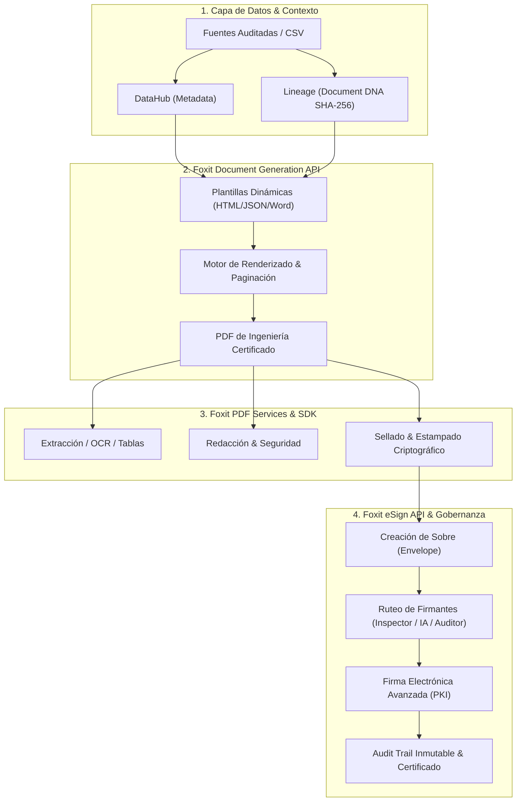

# 🦊 Guía Definitiva y Capacidades de Foxit API en el Ecosistema de Confianza para IA

Este documento detalla todas las capacidades técnicas, endpoints, flujos y casos de uso del ecosistema de **APIs de Foxit**, organizado en sus tres pilares principales: **Foxit Document Generation API**, **Foxit eSign API** y **Foxit PDF Services / SDK**, y su integración directa con nuestro **Ecosistema de Confianza, DataHubs y Lineage Criptográfico**.

---

## 🏗️ 1. Visión General de la Suite Foxit API



---

## 📑 2. Foxit Document Generation API

Permite la creación automatizada de documentos y reportes de alta fidelidad a partir de datos estructurados (JSON, CSV, DataHubs).

### 2.1 Capacidades Principales
1. **Inyección Dinámica de Datos (Data Binding):**
   * Mapeo automático de campos JSON a etiquetas de plantilla (`{{element_id}}`, `{{design_capacity_kn_m2}}`).
   * Soporte para datos anidados y arreglos complejos.
2. **Tablas Dinámicas con Bucles y Matrices Cruzadas:**
   * Iteración sobre colecciones ilimitadas de registros (`{{#each structural_elements}} ... {{/each}}`).
   * Cruce en tiempo real entre tablas de datos de obra y tablas de requisitos normativos (ej. NSR-10).
3. **Lógica Condicional en Plantilla:**
   * Evaluación de reglas lógicas (`if/else`) para aplicar estilos condicionales (ej. alertas rojas si $FS < 1.50$, badges verdes de `PASS` si $FS \ge 1.50$).
4. **Paginación Inteligente y Control de Flujo:**
   * Ruptura automática de páginas (`page-break-inside: avoid;`).
   * Encabezados y pies de página persistentes con numeración dinámica (`Página X de Y`).
   * Márgenes estándar de impresión de ingeniería (A4, Carta, Planos).
5. **Formatos de Entrada y Salida:**
   * **Entradas:** Plantillas HTML5/CSS3, Plantillas JSON de Foxit, Plantillas Microsoft Word (.docx).
   * **Salidas:** PDF nativo de alta resolución, PDF/A (archivo a largo plazo con preservación legal).

### 2.2 Endpoint Típico de Integración
```http
POST https://api.foxit.com/v1/document-generation/templates/render
Authorization: Bearer <FOXIT_API_KEY>
Content-Type: application/json

{
  "template_id": "TPL-STRUCTURAL-NSR10-V1",
  "data": {
    "project_id": "PRJ-FIRE-FLOWER-2026",
    "document_id": "DOC-A1-202601",
    "lineage_hash_report": "e81b29a03c84f18d729b4721f8a11394c8b209d736a19f2d1e028f8d91c2b53a",
    "lineage_hash_norm": "7f3a88c1b994e55a019d82264b18ec0319ca7208d519bfe25471904a58913b82",
    "elements": [
      { "id": "BEAM-V101", "type": "Viga Concreto", "load": 450.0, "capacity": 800.0, "fs": 1.78, "nsr10_min": 1.50, "status": "PASS" },
      { "id": "COL-C201", "type": "Columna Ppal.", "load": 620.0, "capacity": 1200.0, "fs": 1.94, "nsr10_min": 1.75, "status": "PASS" }
    ]
  },
  "options": {
    "output_format": "pdf",
    "pdf_a_compliance": "PDF/A-2b"
  }
}
```

---

## ✍️ 3. Foxit eSign API (Firma Digital y Gobernanza)

Permite la orquestación legal y criptográfica de la firma de documentos generados, condicionada por el motor de Gobernanza y Trust Score.

### 3.1 Capacidades Principales
1. **Gestión Integral de Sobres (Envelopes):**
   * Creación, envío, rastreo, cancelación y descarga de sobres de firma.
   * Estados de ciclo de vida: `DRAFT`, `SENT`, `VIEWED`, `COMPLETED`, `DECLINED`, `EXPIRED`, `BLOCKED_BY_GOVERNANCE`.
2. **Ruteo Secuencial y Paralelo de Firmantes:**
   * Asignación de roles:
     - **Firmante 1:** Inspector Técnico Profesional (Cédula/PE).
     - **Firmante 2 / Agente:** Firma desatendida del Sistema IA (si `Trust Score >= 95%`).
     - **Aprobador / Revisor:** Supervisor Humano de Calidad.
3. **Campos Inteligentes de Firma (Smart Tagging):**
   * Colocación exacta por coordenadas o por anclas de texto (`SignatureField`, `Initials`, `DateSigned`, `ApprovalStamp`, `CryptoSeal`).
4. **Trazabilidad Forense (Certificate of Completion & Audit Trail):**
   * Generación de hoja de auditoría legally binding con IP, timestamp UTC certificado, hash SHA-256 del documento y eventos de visualización/firma.
5. **Webhooks en Tiempo Real:**
   * Notificación automática a la aplicación ante eventos (`envelope.sent`, `envelope.completed`, `recipient.signed`, `envelope.declined`).

### 3.2 Endpoint Típico de Integración
```http
POST https://api.foxit.com/v1/esign/envelopes/create-and-send
Authorization: Bearer <FOXIT_ESIGN_KEY>
Content-Type: application/json

{
  "envelope_title": "Auditoría Estructural NSR-10 — PRJ-FIRE-FLOWER-2026",
  "documents": [
    { "document_name": "Reporte_A1_NSR10_Certificado.pdf", "file_url": "https://storage.foxit-trust.io/docs/DOC-A1-202601.pdf" }
  ],
  "recipients": [
    {
      "recipient_id": "REC-01",
      "name": "Ing. Principal PE",
      "email": "inspector.eng8821@empresa.com",
      "role": "SIGNER",
      "routing_order": 1
    }
  ],
  "security_settings": {
    "require_two_factor": true,
    "audit_trail_embedded": true,
    "crypto_algorithm": "SHA-256-RSA-2048"
  }
}
```

---

## 🛠️ 4. Foxit PDF Services & SDK (Manipulación & Seguridad Avanzada)

Herramientas para procesamiento profundo de PDFs previo a la firma o posterior a la extracción:

1. **Conversión y Renderizado Multiformato:**
   * PDF a HTML / HTML a PDF de pixel-perfect fidelity.
   * PDF a formatos de archivo (PDF/A-1a, PDF/A-2b, PDF/X).
2. **Extracción y OCR Estructurado:**
   * Detección y extracción automática de tablas, formularios y texto plano para alimentar DataHubs.
3. **Seguridad y Cumplimiento:**
   * Redacción permanente (sanitización de datos confidenciales/PII).
   * Estampado de marcas de agua dinámicas (*"AUDITADO POR IA"*, *"GROUND TRUTH VALID"*).
   * Aplanado de formularios (Form Flattening) para congelar la edición antes de archivar.
4. **Optimización y Linearización (Fast Web View):**
   * Compresión de streams de PDF para carga ultrarrápida en navegadores.

---

## 🛡️ 5. Rol de Foxit API en la Arquitectura de Confianza (FIRE FLOWER)

| Capa del Ecosistema | Acción Ejecutada por Foxit API | Valor de Confianza Aportado |
| :--- | :--- | :--- |
| **DataHub & Lineage** | Integra los metadatos y hashes SHA-256 en la cabecera del documento. | **Document DNA:** El documento físico/digital lleva impresa su prueba de inmutabilidad. |
| **Plantilla Oficial** | Genera la matriz cruzada de ingeniería vs NSR-10 con Foxit DocGen. | **Consistencia:** Elimina errores humanos de transcripción de datos. |
| **Gobernanza & Risk** | Condiciona la llamada al endpoint de firma eSign según el `Trust Score`. | **Control:** Si los datos fueron alterados, Foxit bloquea la emisión del envelope. |
| **Firma & Archivo** | Emite el sello criptográfico Foxit eSign y genera el PDF/A auditado. | **Validez Legal:** Certificación *legally binding* lista para juzgados, curadurías o auditorías. |
