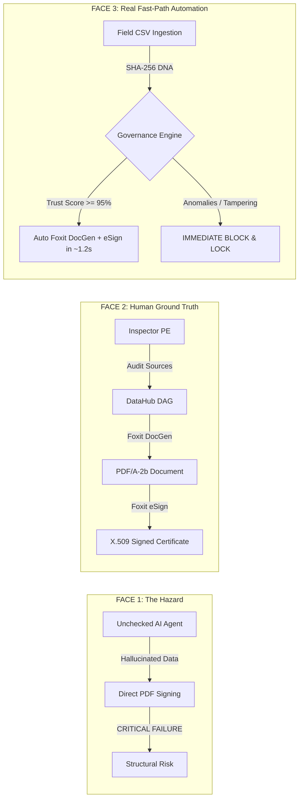

# 🌸 FOXIT — FIRE FLOWER
### *Algorithmic Governance & Verifiable Trust Ecosystem for AI-Driven Document Workflows*

[](https://developers.foxit.com/)
[](https://developers.foxit.com/)
[](https://www.minvivienda.gov.co/)
[](https://developer.mozilla.org/en-US/docs/Web/API/Web_Crypto_API)

> **"FOXIT FIRE FLOWER connects artificial intelligence with a verifiable data layer and converts its results into documentary evidence through Foxit DocGen and Foxit eSign."**

---

### 🌐 Live Demo & Interactive Showcase
- **🚀 Main Landing Page & Portal:** [Open `frontend/foxit_fire_flower_hero.html`](frontend/foxit_fire_flower_hero.html) *(or double-click to view in your browser)*
- **⚡ Face 1 (AI Failure Demo):** [Open `frontend/cara1_simulacion.html`](frontend/cara1_simulacion.html)
- **🛡️ Face 2 (Ecosystem & Governance):** [Open `frontend/index.html`](frontend/index.html)
- **🤖 Face 3 (Live Automation Pipeline):** [Open `frontend/cara3_demo_automatizado.html`](frontend/cara3_demo_automatizado.html)
- **🗺️ Process Map & Architecture:** [Open `frontend/mapa_proceso.html`](frontend/mapa_proceso.html)

> 💡 **Live Backend Execution:** The interactive UI can be browsed directly as static HTML. To execute the **full live end-to-end backend pipeline** connected to Foxit Cloud APIs and DataHub telemetry, follow the [🚀 Quick Start (Local Run)](#-quick-start-local-run) instructions below!

---

## 📖 Overview

**FOXIT FIRE FLOWER** solves a fundamental hazard in modern autonomous systems: **the existential risk of connecting non-deterministic AI agents directly to legally binding signature APIs**.

In mission-critical industries like civil engineering and public infrastructure, an AI hallucination or unnoticed data tampering can lead to catastrophic structural collapse if certified and sealed without verification.

FIRE FLOWER establishes a **3-Layer Trust Ecosystem**:
1. **Document DNA (Client Cryptography):** Instant client-side SHA-256 calculation via Web Crypto API before data leaves the browser.
2. **DataHub Lineage & Deterministic Rules:** Strict 11-column NSR-10 schema verification with non-negotiable physical Safety Factor ($FS = \text{Capacity}/\text{Load}$) evaluation.
3. **Foxit Cloud Developer Suite:** Dynamic Smart Tag injection into official DOCX templates via **Foxit Document Generation API**, rendering immutable PDF/A-2b documents, and automated/manual electronic signature sealing via **Foxit eSign API**.

---

## 🏛️ The 3 Faces of the Ecosystem



- **[Face 1: Agent Failure (Simulation)](frontend/cara1_simulacion.html):** Demonstrates the real-world danger of blind AI automation approving critical structural overloads.
- **[Face 2: Ecosystem & Governance](frontend/index.html):** 3-stage human-in-the-loop audit establishing verifiable Ground Truth.
- **[Face 3: Production Automated Demo](frontend/cara3_demo_automatizado.html):** Sub-1.2s live pipeline with drag & drop CSV ingestion, real-time telemetry, and automated Foxit Cloud dispatch.
- **[Process Map & Architecture](frontend/mapa_proceso.html):** Interactive 6-stage flowchart, technical inspector, and architectural matrix.

---

## 🛠️ Tech Stack & Foxit API Integration

- **Foxit Document Generation Cloud API:** Base64 dynamic DOCX-to-PDF/A-2b generation with custom Smart Tags (`plantilla_ingenieria_nsr10.docx`).
- **Foxit eSign REST API:** Cryptographic envelope dispatch with signature anchors (`[[sig_inspector_pe]]`, `[[sig_ai_governance]]`).
- **Client Cryptography:** SHA-256 Web Crypto API (`crypto.subtle.digest`).
- **Data Governance:** DataHub DAG lineage mapping & 11-column NSR-10 schema enforcement.
- **Backend & Telemetry:** Node.js HTTP server (`scripts/serve.js`).
- **Frontend Design:** High-contrast editorial design system with zero heavy framework overhead.

---

## 🚀 Quick Start (Local Run)

### 1. Prerequisites
- [Node.js](https://nodejs.org/) (v16 or higher)

### 2. Clone the Repository
```bash
git clone https://github.com/GarieleSSGA/FOXIT-FIRE-FLOWER.git
cd FOXIT-FIRE-FLOWER
```

### 3. Configure Environment (Optional for Local Mock)
Copy `.env.example` to `.env` and add your Foxit API credentials:
```bash
cp .env.example .env
```

### 4. Start the Server
```bash
node scripts/serve.js
```

Open your browser at: **`http://localhost:4000`**

---

## 📊 Repository Structure

```
├── adicionales/                  # Submission docs & 25 Tags
│   ├── DEVPOST_SUBMISSION.md
│   └── TAGS_KEYWORDS.md
├── base_de_datos/               # Test datasets (A1 Ground Truth, A2 Regular, A3 Tampered, A4 Collapse)
├── docs/                        # Technical specs & API documentation
├── frontend/                    # Web Application & Interactive Demos
│   ├── foxit_fire_flower_hero.html   # Main Landing Page
│   ├── cara1_simulacion.html         # Face 1: AI Agent Failure Demo
│   ├── index.html                    # Face 2: Human Trust & Governance
│   ├── cara3_demo_automatizado.html  # Face 3: Live Automation Pipeline
│   └── mapa_proceso.html             # Process Map & Flowchart
├── plantillas_foxit/            # DOCX Templates & Smart Tag definitions
└── scripts/
    └── serve.js                 # Node.js backend server with Foxit endpoints
```

---

## 📄 License & Credits
Developed for the **Foxit Developer Challenge / Hackathon 2026** by **GarieleSSGA**.
Protected under the MIT License.
